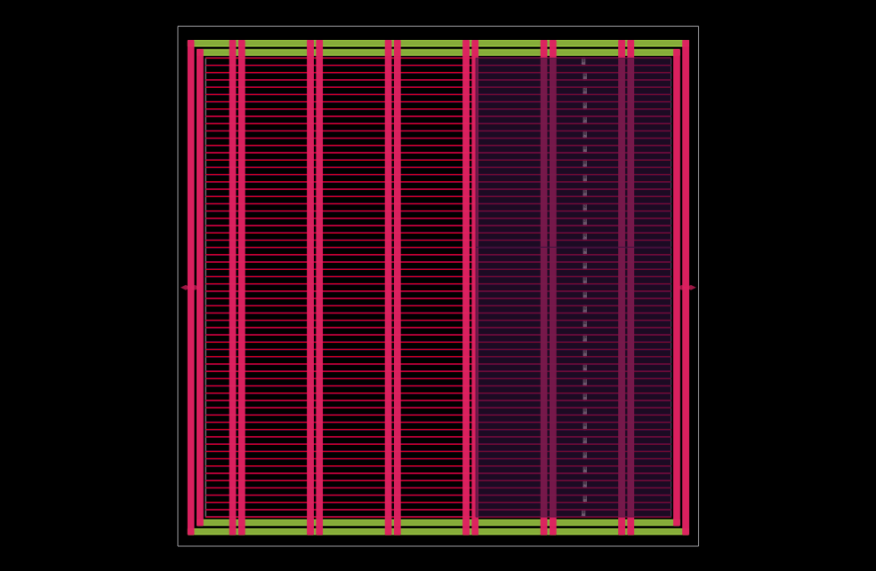
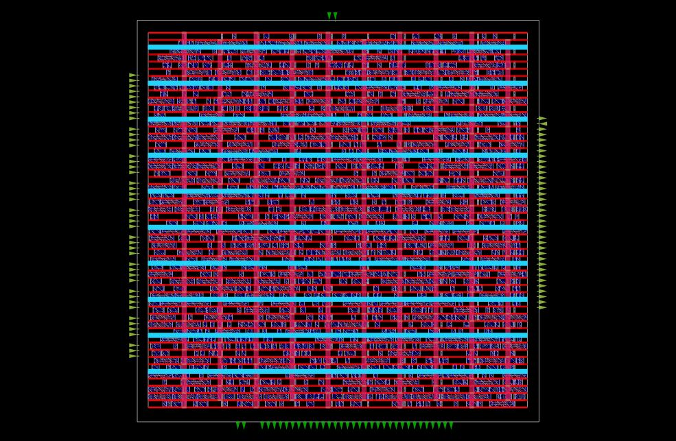
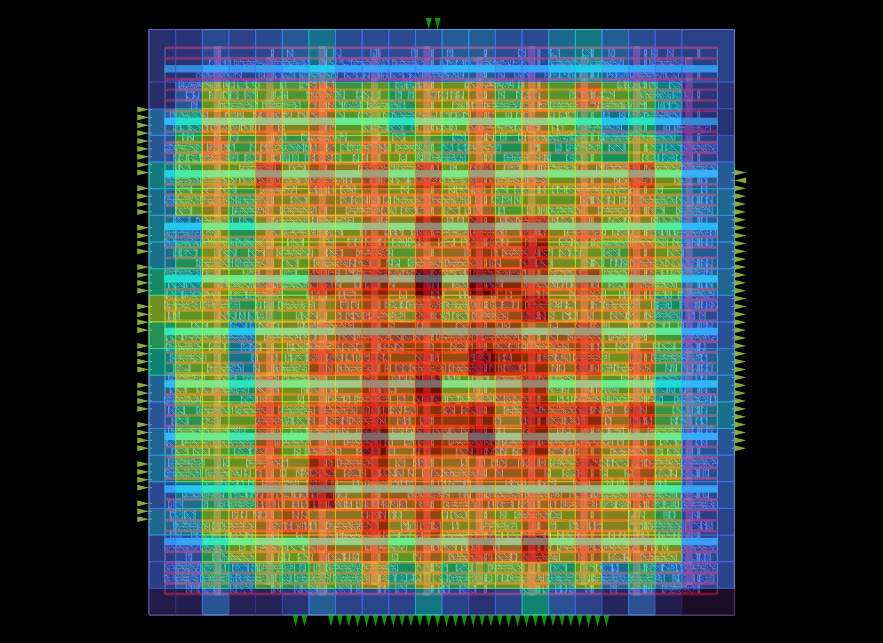
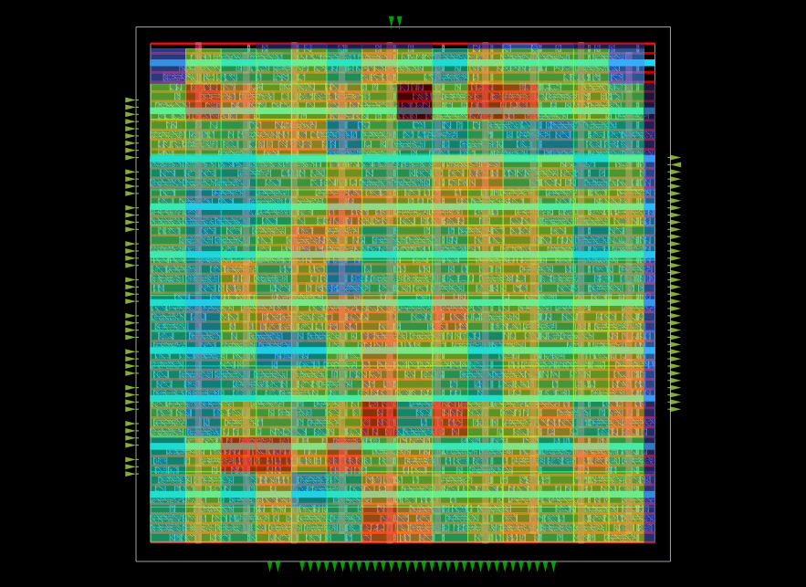
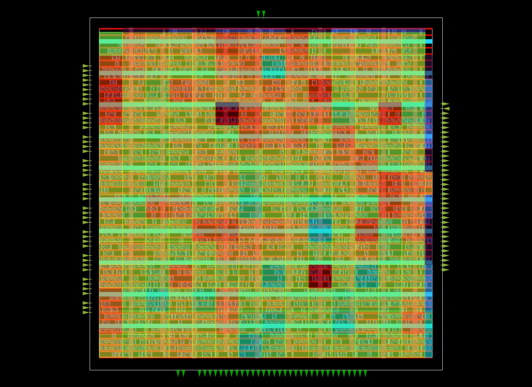

# RTL-to-GDSII of APB4-Interfaced SPI (Serial Peripheral Interface) Master

This repository details the complete RTL-to-GDSII physical design implementation of a configurable **Serial Peripheral Interface (SPI) Master** fully compliant with **AMBA APB4 protocol**. The design is implemented using the open-source SkyWater 130nm HD standard cell library, synthesized with Yosys, and physical design executed via the OpenROAD toolchain. The design supports single-frame transactions up to 128 bits, multiple slave select lines (32), and efficient APB4 register access.

---

## 📁 RTL Architecture & Hardware Specifications

The entire hardware core runs on a single primary system clock (`PCLK`), with no secondary hardware clocks generated. Clock Domain Crossing (CDC) vulnerabilities are mitigated by generating synchronous strobe pulses for shift register operations.

### System Block Diagram
The complete register-transfer level (RTL) architecture including the APB4 controller interface, internal control registers, clock divider, and 128-bit shift registers is illustrated in the complex schematic view below:

### APB4 Peripheral Interface & Top-Level Pins
The top-level module (`spi_top`) implements a native APB4 slave wrapper. Register addressing is byte-addressable via `PADDR[4:2]`, mapping across eight 32-bit registers (TXx, RXx, CTRL, DIV).

| Pin Name | Direction | Width | Protocol | Description |
| :--- | :--- | :--- | :--- | :--- |
| `PCLK` | Input | 1-bit | System | Main Synchronous Bus Clock. All logic runs here. |
| `PRESETn` | Input | 1-bit | System | Active-Low System Reset. |
| `PADDR` | Input | 5-bit | APB4 | Register Address Bus (Bits [4:2] define reg). |
| `PWDATA` | Input | 32-bit | APB4 | Write Data Bus. |
| `PWRITE` | Input | 1-bit | APB4 | High=Write; Low=Read. |
| `PSEL` | Input | 1-bit | APB4 | Peripheral Select. |
| `PENABLE` | Input | 1-bit | APB4 | Strobe for second phase of access. |
| `PSTRB` | Input | 4-bit | APB4 | Byte lanes for partial writes. |
| `PRDATA` | Output | 32-bit | APB4 | Read Data Bus. |
| `PREADY` | Output | 1-bit | APB4 | Ready signal (Tied high, zero wait-state). |
| `PSLVERR` | Output | 1-bit | APB4 | Slave Error signal (Tied low). |
| `ss_pad_o` | Output | 32-bit | SPI | Direct multi-slave select outputs. |
| `sclk_pad_o`| Output | 1-bit | SPI | Generated Serial Clock. |
| `mosi_pad_o`| Output | 1-bit | SPI | Master Out Slave In data line. |
| `miso_pad_i`| Input | 1-bit | SPI | Master In Slave Out data line. |
| `spi_int_o` | Output | 1-bit | Interrupt | High-active transaction complete interrupt. |

### Clock Generation & CDC Mitigation
Reliable operation and complete avoidance of Clock Domain Crossing (CDC) issues are achieved by strictly generating synchronous *strobes* rather than distinct clocks for internal logic. All flip-flops drive exclusively off `PCLK`. The `clk_gen` module monitors an internal counter tracking against the 16-bit `divider` register value to assert single-cycle pulses (`pos_edge` and `neg_edge`).

* **SPI Clock Generation:** The SPI Serial Clock output (`sclk_pad_o`) frequency $f_{\text{SCLK}}$ is derived from the main system clock $f_{\text{PCLK}}$ using the formula:
    $$f_{\text{SCLK}} = \frac{f_{\text{PCLK}}}{2 \times (\text{divider} + 1)}$$
* **Safe Sampling & Launching:** outbound `mosi_pad_o` data bits are launched exclusively on the `neg_edge` strobe. Inbound `miso_pad_i` data bits are sampled exclusively on the `pos_edge` strobe.

### 128-bit Datapath & Shifter
The core provides robust transaction support up to 128 bits per frame. Host CPU access is limited to 32-bit registers (TX_0-TX_3 and RX_0-RX_3). The `shifter.v` module implements complex logic to aggregate or distribute data between the standard APB interface and the wide internal shift registers.

* **Multi-Driver Prevention:** A critical design requirement, verified during RTL coding, is the prevention of multi-driver scenarios where internal signals are driven from multiple `always` blocks. Inside `shifter.v`, all assignment logic for a given counter, shift register, or control bit is constrained within a **single synchronous procedural block**. This ensures that Yosys does not infer conflicting logic or multiple drive for a single net during synthesis.
* **Variable Bit Length support:** The configuration register CHAR_LEN (Bits 11:4 of SPI_CTRL) dynamically sets the exact number of bits per transaction, from 1 up to 128 bits. The datapath uses `PSTRB` byte lanes to enable specific 32-bit latches, allowing efficient partial word writes for smaller transfers.

### Transaction Lifecycle 
The transaction lifecycle is tightly controlled by handshakes between the register file and the shifter logic, using `go`, `t_progress`, and `last_bit` signals.

1.  **Initiation:** The host CPU pre-loads TX registers and sets the `GO` command flag (SPI_CTRL Bit 12).
2.  **Execution:** The control logic asserts `t_progress` and latches CHAR_LEN into the decrement counter (`counter <= len`). The core automatically pre-loads the first bit onto `mosi_pad_o` with zero latency.
3.  **Shifting:** The core decrements the counter at every valid `pos_edge`. The shifter updates MOSI on `neg_edge` and samples MISO on `pos_edge`.
4.  **Completion:** When the counter reaches zero (`last_bit` goes high), the core waits for the final trailing `neg_edge`, then de-asserts `t_progress`. It automatically clears the `GO` bit and fires the external `spi_int_o` high to alert the CPU.

### Control Register Mapping (`SPI_CTRL`)
The 16-bit wide primary configuration register in the top level module (at address offset `0x10`) is mapped as follows:

| Bit Index | Field Flag | Reset | Functional Property |
| :--- | :--- | :--- | :--- |
| `15` | `ASS` | `1'b0` | **Automatic Slave Select:** High = SS lines activate during data transfer only. Low = SS manual software control. |
| `14` | `IE` | `1'b0` | **Interrupt Enable:** Enables firing `spi_int_o` high on frame completion. |
| `13` | `LSB` | `1'b0` | **Bit Order Config:** High = LSB first; Low = MSB first. |
| `12` | `GO` | `1'b0` | **Transaction Init:** Writing `1` initiates the transfer. Automatically cleared on frame complete. |
| `11:4` | `CHAR_LEN` | `8'b0` | **Character Length:** Defines transaction length from 1 to 128 bits. |
| `3:0` | `Reserved` | `4'b0` | Reserved system bits. |

---

## 📑 Timing Constraints & Synthesis Methodology

### Synopsys Design Constraints (SDC) Analysis
The performance and synthesis targets are explicitly defined in `constraints.sdc` using industry-standard commands. All external interfaces are constrained to realistic physical boundaries to model a real system environment.

* **Primary Clock Period:** The design targets a fundamental system period constraint of **5.0 ns** (equivalent to **200 MHz**), defined on the input port `PCLK` under the logical identifier `APB_CLK`.
* **Uncertainty and Latency:** The clock definition includes modeling for explicit source latency and network clock latency values of **0.2 ns**, accounting for physical clock distribution effects.
* **Virtual Clock Reference:** An unmapped virtual clock, `vclk_APB_CLK`, is defined with identical period boundaries to model the behavior of the external SPI slave device interface.
* **Peripheral Delay Boundaries:** The input and output delays are set to **20%** of the target clock period window (**1.0 ns**):
    $$\text{Delay}_{\text{I/O}} = 5.0\,\text{ns} \times 0.20 = 1.0\,\text{ns}$$
    This configuration ensures that all peripheral input signals arrive within the 20% hold time window and all peripheral output signals stabilize within the 20% setup time window.

### Synthesis Execution Workflow
Synthesis is executed via the Yosys open-source synthesis suite, as orchestrated by the `synthesis.tcl` script. The flow generates a technology-mapped gate-level netlist in the SkyWater 130nm HD (High Density) PDK platform using the target performance timing corner model: `sky130_fd_sc_hd__tt_025C_1v80.lib`.

The synthesis flow checks the design through several automated steps:

1.  **RTL Reading & Parsing:** Compiles design files with SystemVerilog parser wrapper (`read_verilog -sv`).
2.  **Elaboration:** Translates behavioral verilog into generic RTL netlist (`proc`), flattens nested hierarchies for optimized DFT placement, and decomposes complex logic like state machines (`fsm`).
3.  **Technology Mapping:** Maps the design to the SkyWater 130nm HD logic gates.
4.  **Gate-Level Optimization:** Integrates specialized components: structural latches (`cells_latch_hd.v`), clock-gating cells (`cells_clkgate_hd.v`), and physical constant tie cells (`sky130_fd_sc_hd__conb_1`) via `hilomap`.
5.  **Netlist Export:** Generates the structural netlist (`spi_top_synth.v`) and outputs a final synthesis statistics report.

## 📐 Floorplanning & Power Delivery Network (PDN)

The physical design phase initiates with floorplanning, establishing the die dimensions, standard cell rows, and the foundational power architecture. The layout is optimized to balance density, routability, and power integrity.

### Floorplan Specifications & Achieved Metrics
The core dimensions and placement grid were initialized using OpenROAD to accommodate the synthesized netlist while reserving adequate routing resources.

| Parameter | Configured Value | Industry Rationale |
| :--- | :--- | :--- |
| **Aspect Ratio** | `1.0` (Square) | Ensures symmetric signal propagation and equalizes average wirelengths across the X and Y axes. |
| **Target Utilization** | `65%` | A 65% density target provides a 35% whitespace buffer. This is critical in the 130nm node to absorb cell swelling during Clock Tree Synthesis (CTS) and mitigate congestion during detailed routing. |
| **Core Margins** | `15.0 um` (All sides) | Provides ample boundary clearance for robust IO pin placement, ring routing, and decoupling capacitor insertion. |
| **Achieved Utilization** | **`63%`** | Actual standard cell density post-floorplanning, successfully meeting the target threshold. |
| **Total Design Area** | **`12712 um^2`** | Final active core area required to map the SPI Master logic. |

### Tap Cell Insertion
To prevent CMOS latch-up conditions, substrate tap cells (`sky130_fd_sc_hd__tapvpwrvgnd_1`) were systematically inserted across the standard cell rows at a strictly defined distance of **14.0 um**. This ensures the N-wells are securely tied to `VDD` and the P-substrate is tied to `VSS`, strictly satisfying SkyWater 130nm DRC maximum tap-distance rules. 

### Power Delivery Network (PDN) Architecture
A robust PDN grid is synthesized to supply `VDD` and `VSS` to the standard cells while minimizing **IR drop** (voltage droop) and electromigration (EM) risks. The PDN leverages a hierarchical metal stack approach:

1. **Layer 1: Standard Cell Rails (`met1`)**
   * **Width:** `0.48 um` | **Pitch:** `5.44 um`
   * **Strategy:** Created using the `-followpins` argument. Standard cell transistors in the Sky130 HD library have their power and ground pins located on Metal 1. These continuous rails perfectly align with the cell rows.
2. **Layer 4: Intermediate Power Straps (`met4`)**
   * **Width:** `1.60 um` | **Pitch:** `27.20 um`
   * **Strategy:** Thick, low-resistance vertical and horizontal straps distribute power across the core. By pushing the intermediate grid up to `met4`, lower metal layers (`met2`, `met3`) are preserved entirely for dense, localized signal routing, drastically reducing routing congestion.
3. **Layer 5: Top-Level Power Grid (`met5`)**
   * **Width:** `1.60 um` | **Pitch:** `27.20 um`
   * **Strategy:** The primary external power interface layer. Higher metal layers in the Sky130 stack have significantly lower sheet resistance. Creating a dense mesh at `met5` provides a low-impedance path from the external supply down to the core, minimizing global IR drop.

### Via Stack Configuration
To connect this hierarchical grid, custom via stacks are instantiated to pull power from the top-level `met5` mesh down to the `met1` standard cells:
* `via_4_5`: Drops power from `met5` to `met4`.
* `via_1_4`: A full-stack via array bridging the intermediate straps directly to the cell rails (comprising stacked vias from M1→M2, M2→M3, and M3→M4).

## Standard Cell Placement & I/O Pin Assignment

Following floorplanning and PDN synthesis, the standard cells synthesized by Yosys are physically placed onto the site rows of the core area. The placement phase is executed in two primary steps: Global Placement, which focuses on minimizing the total wirelength and preventing excessive routing congestion, followed by Detailed Placement, which legalizes the cells onto the actual placement grid to prevent overlaps.

### I/O Pin Placement Strategy
Before placing the internal standard cells, the top-level input/output pins (such as the APB4 bus signals and SPI output pads) are strategically placed along the core boundaries. Pins are grouped by bus functionality (e.g., grouping `PWDATA` bits and `ss_pad_o` bits) and are primarily assigned to routing layers **Metal 2 (`met2`)** and **Metal 3 (`met3`)**. This layer selection keeps the outer boundary connections off the base metal layer, allowing standard cells to be placed closer to the boundary without DRC violations, while preserving upper metal layers for power and global routing.

### Placement Quality & Achieved Metrics
The detailed placement successfully legalized all instances using a diamond search algorithm, ensuring zero standard cell overlaps and minimizing displacement from their ideal global placement locations. 

| Placement Metric | Achieved Value | Industry Context |
| :--- | :--- | :--- |
| **Total Standard Cells** | `1266` | The total count of logic gates, flip-flops, and tap cells physically mapped to the core. |
| **Instance Area** | `12568.30 um^2` | The total silicon area strictly consumed by the standard cells. |
| **Effective Utilization** | `62.1%` | The active density remains stable, leaving sufficient whitespace for clock tree buffers and routing detours. |
| **Total HPWL** | `32905.3 um` | Half-Perimeter Wirelength. A critical metric indicating the estimated total routing length; lower values correspond to lower dynamic power and better timing. |
| **Placement Legality** | `100% Success` | Zero placement failures or overlapping cells reported after detailed placement. |
| **Timing (WNS / TNS)** | `0.00 ns` / `0.00 ns` | Worst Negative Slack and Total Negative Slack are clean at this stage, indicating no early setup/hold violations based on estimated wire delays. |

### Congestion & Density Analysis
To ensure the design is highly routable and free of localized thermal or congestion hotspots, several spatial density evaluations are performed across the core. The heatmaps below illustrate the distribution of these critical parameters:

| Routing Congestion | Pin Density | Power Density |
| :---: | :---: | :---: |
|  |  |  |
| **Estimated Routing Congestion:** Highlights areas where the demand for routing tracks approaches the available supply. The placement tool successfully dispersed logic to prevent severe chokepoints, ensuring smooth detailed routing later in the flow. | **Standard Cell Pin Density:** Visualizes the concentration of input and output pins. An even distribution is crucial to prevent the router from failing to access specific standard cell pins in highly packed regions. | **Estimated Power Density:** Projects the spatial distribution of dynamic and static power consumption based on cell placement. An even power profile mitigates localized IR drop and thermal localized heating. |
