# RTL-to-GDSII of an APB4-Interfaced SPI Master on the ASAP7 7nm FinFET Node


This repository documents a full RTL-to-GDSII implementation of a configurable **Serial Peripheral Interface (SPI) Master**, wrapped in a native **AMBA APB4** slave interface, taken all the way from Verilog to a manufacturing-ready GDSII stream.

The design closes timing at a **400 ps clock period — a 2.5 GHz system clock** — on the **ASAP7 7nm predictive FinFET PDK**, with a completely DRC-clean layout and healthy positive slack on every path group.

An earlier version of this project targeted the SkyWater 130nm planar node. It has since been **re-implemented on ASAP7**, a 7.5-track, 7nm FinFET process. Synthesis is handled by **Yosys** (with **ABC** for mapping), physical implementation by **OpenROAD**, and GDS stream-out by **KLayout**.

---

## Table of Contents

- [Why ASAP7 / 7nm FinFET](#why-asap7--7nm-finfet)
- [RTL Architecture & Hardware Specifications](#rtl-architecture--hardware-specifications)
  - [Top-Level Module (`spi_top`)](#top-level-module-spi_top)
  - [Top-Level Pinout](#top-level-pinout)
  - [Clock Generation — Strobes, Not Clocks](#clock-generation--strobes-not-clocks)
  - [128-bit Datapath (`shifter.v`)](#128-bit-datapath-shifterv)
  - [Transaction Lifecycle](#transaction-lifecycle)
  - [Control Register (`SPI_CTRL`, offset `0x4`, 16-bit)](#control-register-spi_ctrl-offset-0x4-16-bit)
- [Timing Constraints (`constraints.sdc`)](#timing-constraints-constraintssdc)
- [Synthesis (Yosys + ABC)](#synthesis-yosys--abc)
- [Floorplan & Power Delivery Network](#floorplan--power-delivery-network)
  - [Die & Core](#die--core)
  - [Tap Cells](#tap-cells)
  - [PDN Architecture](#pdn-architecture)
- [Placement & I/O Pin Assignment](#placement--io-pin-assignment)
  - [I/O Pin Strategy](#io-pin-strategy)
  - [Global & Detailed Placement](#global--detailed-placement)
- [Clock Tree Synthesis (TritonCTS)](#clock-tree-synthesis-tritoncts)
- [Global Routing (FastRoute) & Optimization](#global-routing-fastroute--optimization)
- [Detailed Routing (TritonRoute)](#detailed-routing-tritonroute)
  - [Guide Coverage](#guide-coverage)
- [Physical Signoff & Power Integrity](#physical-signoff--power-integrity)
  - [Filler Insertion](#filler-insertion)
  - [Sign-off Parasitic Extraction (OpenRCX)](#sign-off-parasitic-extraction-openrcx)
  - [Sign-off Timing](#sign-off-timing)
  - [Power (SPEF-accurate)](#power-spef-accurate)
  - [IR Drop & Electromigration](#ir-drop--electromigration)
  - [Sign-off Spatial Heatmaps](#sign-off-spatial-heatmaps)
- [GDSII Generation (KLayout)](#gdsii-generation-klayout)
- [Physical Verification / DRC Sign-off](#physical-verification--drc-sign-off)
- [Results at a Glance](#results-at-a-glance)
- [Toolchain](#toolchain)


---

## Why ASAP7 / 7nm FinFET

- **FinFET electrostatics.** The tri-gate FinFET structure wraps the gate around a thin silicon fin on three sides. That gives dramatically tighter channel control, sharper sub-threshold slope, and far lower leakage per unit drive than a planar 130nm transistor. In practice this is what lets the design run an order of magnitude faster while still sipping power.
- **Frequency headroom.** On Sky130 the design ran at a 5 ns period (200 MHz). On ASAP7 the same RTL closes at a **400 ps period — 2.5 GHz**, a 12.5× frequency jump for essentially the same architecture. The gate delays in the 7nm library are small enough that even long combinational cones through the shift datapath fit comfortably inside 400 ps.
- **Low-voltage operation.** ASAP7 operates at a nominal **0.7 V** supply versus 1.8 V on Sky130. Dynamic power scales with V², so the lower rail is a big part of why the total power lands near **1.2 mW** despite the much higher clock.
- **A deep metal stack.** ASAP7 exposes 9 routing metals (M1–M9). This flow uses M1–M7 for signals and M4–M7 for the clock, which keeps the fast-switching clock on the thicker, lower-resistance upper metals and leaves plenty of routing resource for the wide 128-bit datapath.

The trade-off is that FinFET nodes are far less forgiving about pin access and density, which is why the physical flow adds cell padding, tighter PDN pitches, and diode-based antenna repair — all detailed below.

---

## RTL Architecture & Hardware Specifications

The entire core runs on a single primary clock, the APB bus clock `PCLK`. There is **no second hardware clock generated anywhere in the design**. The SPI serial clock is produced as a strobed enable off `PCLK`, not as a free-running clock, so there is exactly one clock domain and no clock-domain-crossing (CDC) hazard to close.

### Top-Level Module (`spi_top`)

`spi_top` is a native APB4 slave. Registers are byte-addressable; the register index is decoded from `PADDR[4:2]`, mapping onto eight logical 32-bit registers (four TX/RX aliases plus CTRL, DIVIDER, SS, STATUS). `PREADY` is tied high (zero wait-state) and `PSLVERR` is tied low (no error response), which keeps the peripheral simple and single-cycle from the bus perspective.

The design instantiates two sub-modules:

- **`clk_gen`** — generates the SPI serial clock (`sclk_pad_o`) and the `pos_edge` / `neg_edge` strobe pulses that pace every transfer.
- **`shifter`** — the 128-bit bidirectional shift datapath that launches MOSI and samples MISO.

### Top-Level Pinout

| Pin | Dir | Width | Group | Description |
| :--- | :--- | :--- | :--- | :--- |
| `PCLK` | In | 1 | System | Main synchronous bus clock. All flops run on this. |
| `PRESETn` | In | 1 | System | Active-low asynchronous reset. |
| `PADDR` | In | 5 | APB4 | Register address (bits `[4:2]` select the register; `[1:0]` unused). |
| `PWDATA` | In | 32 | APB4 | Write data bus. |
| `PWRITE` | In | 1 | APB4 | 1 = write, 0 = read. |
| `PSEL` | In | 1 | APB4 | Peripheral select. |
| `PENABLE` | In | 1 | APB4 | Access (second) phase strobe. |
| `PSTRB` | In | 4 | APB4 | Byte lane strobes for partial-word writes. |
| `PRDATA` | Out | 32 | APB4 | Read data bus. |
| `PREADY` | Out | 1 | APB4 | Ready — tied high, zero wait-state. |
| `PSLVERR` | Out | 1 | APB4 | Slave error — tied low. |
| `ss_pad_o` | Out | 32 | SPI | 32 independent slave-select lines. |
| `sclk_pad_o` | Out | 1 | SPI | Generated serial clock (SPI Mode 0, CPOL=0). |
| `mosi_pad_o` | Out | 1 | SPI | Master-out, slave-in. |
| `miso_pad_i` | In | 1 | SPI | Master-in, slave-out. |
| `spi_int_o` | Out | 1 | IRQ | Active-high transaction-complete interrupt. |

### Clock Generation — Strobes, Not Clocks

`clk_gen` never gates or forks the system clock. Instead it runs a 16-bit down-counter off `PCLK`, reloading it from the `DIVIDER` register, and derives the serial clock and its edge strobes from the counter reaching its terminal values. The serial clock frequency is:

$$f_{\text{SCLK}} = \frac{f_{\text{PCLK}}}{2 \times (\text{divider} + 1)}$$

with `divider` a 16-bit value (0…65535), so the SPI link can be tuned from `PCLK`/2 all the way down to very slow transfers. The module implements **SPI Mode 0 (CPOL=0, CPHA=0)**: `clk_out` idles low, MOSI is launched on `neg_edge`, and MISO is sampled on `pos_edge`. Because everything is a single-cycle strobe on the one clock, the launch and sample edges are inherently synchronous and require no synchronizers.

### 128-bit Datapath (`shifter.v`)

The shifter supports transactions of **1 to 128 bits** in a single frame, even though the host CPU only ever sees 32-bit registers. It reuses **one shift register for both TX and RX**, which is safe precisely because Mode 0 reads and writes happen on opposite clock edges (write on `neg_edge`, read on `pos_edge`) — the two never contend for the register on the same cycle.

Key datapath features:

- **Byte-lane loading.** The CPU writes 32-bit words into one of four TX slots (`TX_0`…`TX_3`) via a one-hot `latch`, and `PSTRB` selects which of the four bytes in that word are actually written. This gives clean word / half-word / byte writes into the 128-bit register without read-modify-write.
- **Configurable bit order.** The `LSB` control bit selects MSB-first or LSB-first shifting, changing the initial bit-position pointers accordingly.
- **Single-driver discipline.** Every register (the down-counter, `tx_bit_pos`, `rx_bit_pos`, `serial_out`, `OUT_reg`, `IN_reg`) is written from exactly one `always` block. This was a deliberate fix during RTL bring-up: consolidating each net into a single synchronous procedural block prevents Yosys from inferring multiply-driven nets, which would otherwise break synthesis and LVS.

### Transaction Lifecycle

The transfer is coordinated by a small handshake between the control registers and the shifter, using `go`, `t_progress` (transfer-in-progress), and `last_bit`:

1. **Load** — the CPU writes the TX registers, sets `CHAR_LEN`, and asserts `GO`.
2. **Start** — the shifter sees `go & !t_progress`, raises `t_progress`, loads `CHAR_LEN` into the counter, and preloads the first bit onto MOSI immediately, so the very first `sclk` edge already carries valid data.
3. **Shift** — on each `pos_edge` the counter decrements and a MISO bit is captured; on each `neg_edge` a fresh MOSI bit is launched.
4. **Finish** — when the counter empties, `last_bit` asserts; the core waits for the final trailing `neg_edge`, drops `t_progress`, auto-clears the `GO` bit, and (if `IE` is set) pulses `spi_int_o` high so the CPU can run its read ISR. The interrupt self-clears on the next APB read.

### Control Register (`SPI_CTRL`, offset `0x4`, 16-bit)

| Bit | Field | Reset | Function |
| :--- | :--- | :--- | :--- |
| `15` | `ASS` | 0 | Automatic slave select — SS asserts only during a live transfer when set; otherwise SS is software-controlled. |
| `14` | `IE` | 0 | Interrupt enable — fire `spi_int_o` on frame completion. |
| `13` | `LSB` | 0 | Bit order — 1 = LSB-first, 0 = MSB-first. |
| `12` | `GO` | 0 | Start transfer — auto-cleared when the frame completes. |
| `11:4` | `CHAR_LEN` | 0 | Character length, 1…128 bits. |
| `3:0` | — | 0 | Reserved. |

The slave-select output logic implements both modes in one expression: with `ASS=1` the selected `ss` bits assert only while `t_progress` is high; with `ASS=0` they follow the `ss` register directly under software control. Outputs are active-low at the pad.

---

## Timing Constraints (`constraints.sdc`)

Timing is defined in `ps` units. The design is deliberately constrained hard to expose the frequency ceiling of the 7nm library.

- **Primary clock:** `create_clock` on `PCLK`, named `APB_CLK`, with a **400 ps period → 2.5 GHz**.
- **Virtual I/O clock:** a portless virtual clock `vclk_APB_CLK` with the same 400 ps period, used as the timing reference for all primary I/O so that the external SPI/APB interface is modeled realistically.
- **Clock latency:** 200 ps of latency is applied to both clocks to model network insertion delay.
- **I/O delays:** input and output delays are set to **20% of the period (80 ps)** against the virtual clock, so every input must arrive, and every output must settle, within a 20% window at the boundary.

The ABC mapping constraints (`abc.constr`) drive every primary input with an `BUFx2_ASAP7_75t_R` cell and apply a 5-unit load, so that the synthesizer optimizes against a realistic boundary drive/load rather than an ideal one.

---

## Synthesis (Yosys + ABC)

`synthesis.tcl` reads the three RTL files, elaborates and optimizes them, and maps to the ASAP7 7.5-track RVT library. The clock period is auto-scraped from the SDC so synthesis and STA always agree.

The flow, briefly:

1. **Read & elaborate** — `read_verilog -sv`, `hierarchy -check -top spi_top`, then `proc`, `opt`, `fsm`, `memory`, `flatten`, `techmap` to lower behavioral RTL into a generic gate netlist.
2. **Sequential mapping** — flip-flops are mapped with `dfflibmap` against the dedicated ASAP7 sequential library (`asap7sc7p5t_SEQ_RVT_TT`).
3. **Combinational mapping** — the ASAP7 combinational libraries (SIMPLE, INVBUF, AO, OA) are stitched into a single merged Liberty file, and **ABC** maps and timing-optimizes the logic against it using the speed script and the auto-generated period target.
4. **Cleanup** — `splitnets`, `hilomap` (tie cells `TIEHIx1` / `TIELOx1`), and `clean` finish the netlist, which is written out as `spi_top_synth.v`.

The gate-level design uses the standard ASAP7 cell zoo — `DFFASRHQNx1` async-reset flops, `HB1xp67` / `BUFx` buffers, and NAND/NOR/AOI/OAI logic — visible throughout the timing reports.

---

## Floorplan & Power Delivery Network

`floorplan.tcl` initializes the die, the site rows, the tap cells, and the full PDN.


### Die & Core

The floorplan is auto-sized from a target utilization of **70%** at a **1:1 aspect ratio**, with a 1-site core-to-die margin on each edge.

| Parameter | Value |
| :--- | :--- |
| Die area | **19.27 µm × 19.27 µm** |
| Core box | (1.026, 1.080) → (18.252, 18.090) µm |
| Core area | **293.01 µm²** |
| Placement site | `asap7sc7p5t` (0.054 µm × 0.270 µm) |
| Site rows | 63 rows |
| Instances | 1853 |
| Effective utilization | ~71% |

At this node the whole SPI Master fits in a **~371 µm² die** — a striking illustration of FinFET density; the identical logic occupied 2100 µm² on Sky130.

### Tap Cells

`TAPCELL_ASAP7_75t_R` cells are inserted at a **14-site pitch** to tie the wells to the rails and prevent latch-up, satisfying the ASAP7 maximum tap-distance rule. 32 tap cells were placed.

### PDN Architecture

A single `CORE` voltage domain (VDD/VSS) is built with a hierarchical mesh, plus global connections that tie the cell power pins (`VDD`/`VSS`) and the FinFET body-bias pins (`VPB` → VDD, `VNB` → VSS):

1. **M1 followpin rails** — 0.018 µm wide on a 0.54 µm pitch, aligned to the standard-cell power pins.
2. **M2 followpin rails** — 0.018 µm on a 0.54 µm pitch, reinforcing the local grid.
3. **M5 horizontal straps** — 0.216 µm wide, 0.12 µm spacing, 2.88 µm pitch, extended into the core ring.
4. **M4/M5 core ring** — 0.216 µm wide with 0.12 µm spacing and a 0.1 µm core offset, tying all row ends together.

Vias stitch the layers (M1↔M2, M2↔M5, M4↔M5) so power drops cleanly from the top-level mesh to the cell rails. The full grid is realized with `pdngen`.

---

## Placement & I/O Pin Assignment

`placement.tcl` performs I/O placement, timing-driven global placement, legalization, and design repair.


### I/O Pin Strategy

Rather than letting the tool scatter pins, each functional bus is pinned to a specific die edge and grouped so bus bits stay adjacent:

- **Top:** `PCLK`, `PRESETn` (clock/reset).
- **Left:** the APB4 control and write path — `PSEL`, `PENABLE`, `PWRITE`, `PADDR`, `PSTRB`, `PWDATA[31:0]`.
- **Bottom:** the APB4 read path — `PRDATA[31:0]`, `PREADY`, `PSLVERR`.
- **Right:** the SPI interface — `ss_pad_o[31:0]`, `sclk_pad_o`, `mosi_pad_o`, `miso_pad_i`, `spi_int_o`.

Pins are placed on **M2 (horizontal edges)** and **M3 (vertical edges)** with corner avoidance and a 0.3 µm minimum spacing, and the resulting placement is written to `pin_placement.txt`. Of 220 available slots, 116 I/O were placed across 30 pin groups (I/O-net HPWL ≈ 1466 µm).

### Global & Detailed Placement

- **Cell padding** — a mandatory 1-site left/right pad is applied globally. On sub-10nm FinFET this is not optional: without the padding, pin-access DRCs are almost guaranteed at high density.
- **Global placement** — run `-timing_driven -routability_driven` at a 0.60 target density. (The engine notes that 0.60 is below the minimum feasible density for the available area and auto-lifts the working target to ~0.79.)
- **Design repair** — `repair_design` fixes early max-slew / max-cap / high-fanout violations, and the timing-driven pass actually *recovers* area (≈ −5.4%) by right-sizing over-driven cells.
- **Legalization** — a diamond-search legalizer snaps every cell to a legal site (±500 sites horizontal, ±100 rows vertical), reporting **100% move success** with zero rip-up-and-replace fallbacks.

Post-placement the design sits at **~197 µm² instance area, ~67% utilization**, with WNS/TNS clean on placement-stage RC estimates.

---

## Clock Tree Synthesis (TritonCTS)

`cts.tcl` builds a balanced X-tree over the single `PCLK` domain, then legalizes and repairs timing.

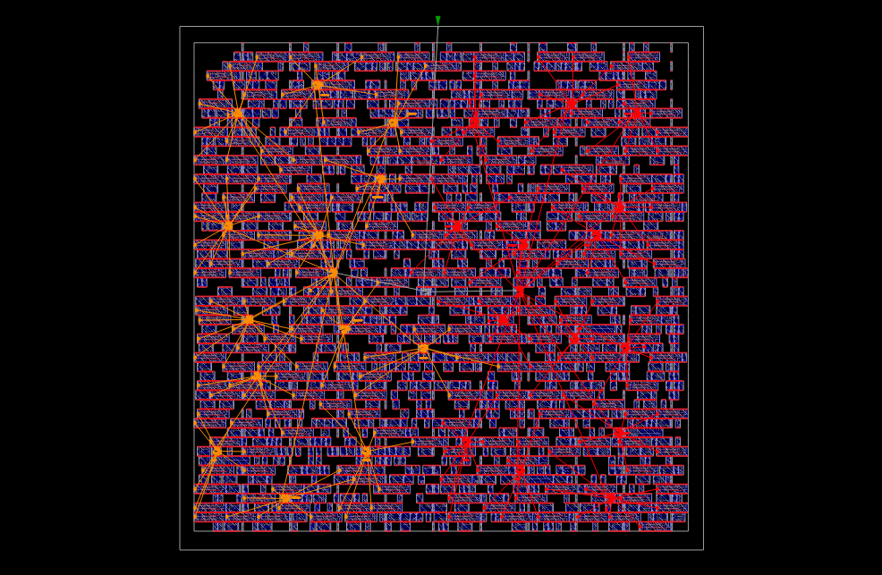

The tree is built with sink clustering enabled and a three-buffer palette (`BUFx2`, `BUFx4`, `BUFx8` ASAP7). Sinks are clustered to reduce local wirelength and clock power before the H-tree is drawn.

| Metric | Value |
| :--- | :--- |
| Clock net / domain | `PCLK` / `APB_CLK` |
| Clock roots | 1 |
| Sinks (flop clock pins) | 229 |
| Sinks after clustering | 25 leaf clusters |
| Root buffer | `BUFx4_ASAP7_75t_R` |
| Leaf/sink buffer | `BUFx8_ASAP7_75t_R` |
| Buffers inserted | 28 (3× BUFx4, 25× BUFx8) |
| Clock subnets | 28 |
| Clock-path depth | 2–3 buffers |
| Avg sink wirelength | 21.82 µm |
| Max tree level | 1 |

After CTS the flow runs `repair_clock_inverters`, re-estimates parasitics, legalizes the inserted buffers, and runs `repair_timing -match_cell_footprint` so that any resizing preserves cell footprints and placement legality. Post-CTS timing reports **zero setup and zero hold violations** (WNS/TNS = 0), with the worst recovery/setup paths still holding double-digit-picosecond positive slack.

---

## Global Routing (FastRoute) & Optimization

`global_route.tcl` assigns coarse routes and runs the heavy PPA-optimization loop.

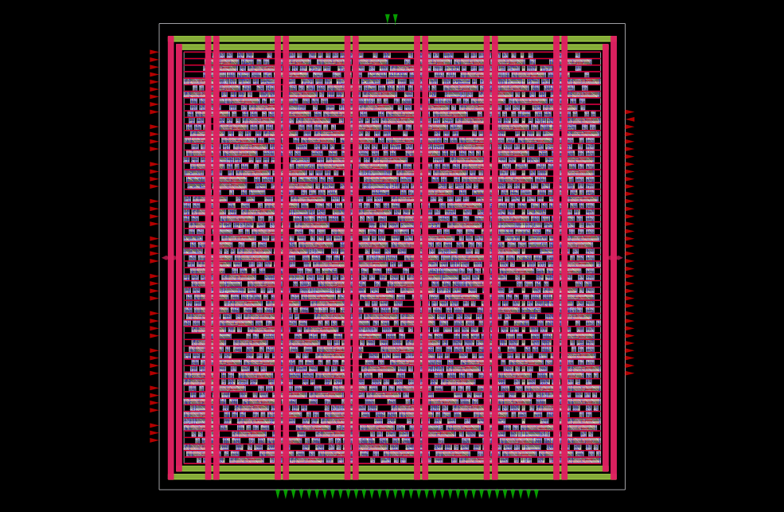

Routing layers are constrained to **M1–M7 for signals** and **M4–M7 for the clock**, keeping the clock on the thicker upper metals. Global routing runs with 50 congestion iterations, then the script iterates through:

1. **Parasitic-aware repair** — `estimate_parasitics -global_routing` followed by `repair_design` to clear DRVs on the now-real wire loads.
2. **Incremental re-route** — `global_route -start_incremental … -end_incremental` re-routes only the nets touched by repair, not the whole chip.
3. **Timing repair** — `repair_timing -match_cell_footprint` fixes any setup/hold exposed by wire delay.
4. **Power recovery** — `repair_timing -recover_power 100` downsizes high-drive cells on positive-slack paths, trimming dynamic power, leakage, and area without breaking timing.
5. **Antenna repair** — `repair_antennas -diode_only` inserts antenna diodes (the ASAP7-appropriate strategy) to clear plasma-etch charge accumulation.

**Global-route wirelength by layer** shows the datapath living mostly on M2/M3, exactly where an intermediate-density design should sit:

| Layer | Wirelength | Share |
| :--- | :--- | :--- |
| M1 | 55.9 µm | ~0% |
| M2 | 2648.8 µm | 45% |
| M3 | 2395.1 µm | 41% |
| M4 | 575.1 µm | 9% |
| M5 | 156.8 µm | 2% |

Routing overflow converges to **0 overflowed tiles**, and WNS/TNS remain clean. Routing guides are written to `spi_top.route_guide` for the detailed router.

---

## Detailed Routing (TritonRoute)

`detail_route.tcl` turns the guides into real, DRC-clean metal with TritonRoute.

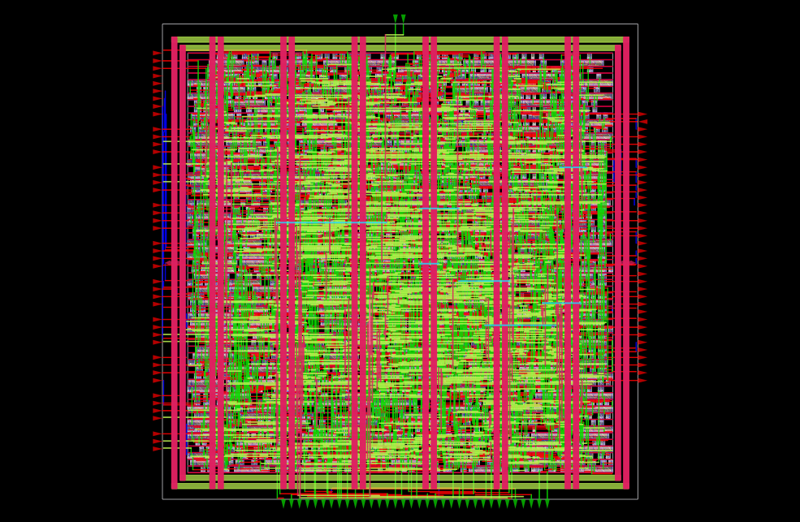

The router is launched with clean-patch enabled and an end-iteration request of 100 (the tool caps this at its internal maximum of 64) against 15,128 routing guides. It converges monotonically from a large initial violation count down to zero:

| Iteration | Violations |
| :--- | :--- |
| 0th (initial) | 830 |
| 1st | 143 |
| 2nd | 135 |
| 3rd | 8 |
| 4th | 1 |
| final | **0** |

**Final detailed-route results:**

| Metric | Value |
| :--- | :--- |
| Total wirelength | **6200 µm** |
| Total vias | **17,175** |
| Final DRC violations | **0** |
| Design area / utilization | 201 µm² / 69% |
| Setup / hold slack | positive on all paths (MET) |

`design_is_routed` confirms 100% connectivity, and `check_antennas` passes. The per-layer wirelength (M3-heavy, with real M4 usage and a light touch of M5–M7) reflects a clean, well-spread route.

### Guide Coverage

`guide_coverage.rpt` records how faithfully the detailed router stayed inside the global-route guides. Overall coverage is **72.87%**, with the lower, most-used layers tracking their guides tightly — **M1 91.7%, M2 95.9%, M3 84.2%**. The router only strayed off-guide where it had to, to resolve pin access and hard DRC conflicts on the upper metals.

---

## Physical Signoff & Power Integrity

`physical_signoff.tcl` inserts fillers, extracts sign-off parasitics, and runs power, IR-drop, and electromigration analysis.

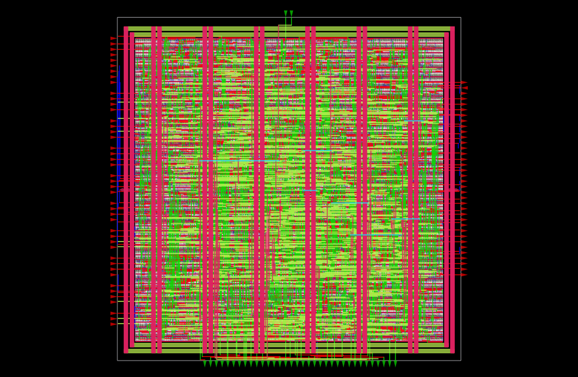

### Filler Insertion

**3390 filler cells** (`FILLER_ASAP7_75t_R` ×2911, `FILLERxp5_ASAP7_75t_R` ×479) fill the remaining row gaps, restoring well continuity and completing the VDD/VSS rails. `check_placement` passes after filler insertion and after the global-connect pass.

### Sign-off Parasitic Extraction (OpenRCX)

The estimated routing RC is discarded and replaced with a real 3D extraction. OpenRCX, driven by `rcx_patterns.rules`, extracts all **14,766 wires** and writes a **SPEF** (`spi_parasitics.spef`), which is read back into OpenSTA for final timing and power.

### Sign-off Timing

Against the back-annotated SPEF, the design clears the **2.5 GHz (400 ps)** constraint with margin on every path group:

| Path group | Worst slack | Status |
| :--- | :--- | :--- |
| Setup — APB_CLK (miso → flop) | +3.21 ns* | MET |
| Setup — vclk_APB_CLK (PADDR → PRDATA) | +12.67 ns* | MET |
| Setup — asynchronous recovery (PRESETn) | +9.01 ns* | MET |
| Worst hold | +40.07 ns* | MET |
| WNS / TNS (max) | 0.00 / 0.00 | MET |

\* Slacks are reported in `ps` in the raw logs; values here are the reported worst-path slacks. The point is simply that every group is positive — there are **no setup or hold violations** anywhere in the routed, extracted design.

### Power (SPEF-accurate)

Total power against the extracted parasitics is **≈ 1.207 mW** at 0.7 V and 2.5 GHz:

| Group | Internal | Switching | Leakage | Total | Share |
| :--- | :--- | :--- | :--- | :--- | :--- |
| Sequential | 0.559 mW | 0.0096 mW | 43.6 nW | 0.569 mW | 47.2% |
| Combinational | 0.029 mW | 0.071 mW | 60.9 nW | 0.100 mW | 8.3% |
| Clock | 0.296 mW | 0.242 mW | 8.7 nW | 0.537 mW | 44.5% |
| **Total** | **0.885 mW** | **0.322 mW** | **113 nW** | **1.207 mW** | **100%** |

Sequential and clock power dominate (together ~92%), which is exactly what you'd expect from a heavily-registered 128-bit shift architecture with 229 clocked sinks. Note the leakage: at **113 nW total** it is essentially negligible next to dynamic power — a direct benefit of the FinFET's tight channel control, and a sharp contrast to the leakage budgets typical of older planar nodes.

### IR Drop & Electromigration

Static IR analysis (`analyze_power_grid`, `-source_type STRAPS`) validates the PDN. The voltage-source `.loc` file is generated automatically from the sign-off DEF by `generate_pdn_sources.py`, which parses the DIEAREA and metal tracks and drops a source every N tracks.

**VDD IR-drop summary:**

| Metric | Value |
| :--- | :--- |
| Supply voltage | 0.700 V |
| Worst-case node voltage | 0.699 V |
| Average IR drop | 0.102 mV |
| Worst-case IR drop | 0.709 mV |
| Percentage drop | **0.10%** |

A worst-case droop of **~0.71 mV on a 0.7 V rail** (0.10%) confirms the mesh is comfortably over-provisioned for this design's current draw. The concurrent EM check (`-enable_em`) found peak branch currents on the order of tens of µA on VDD and ~0.19 mA on VSS — orders of magnitude below any credible current-density limit for these straps.

The static IR-drop heatmap below maps the voltage across the entire VDD mesh. The near-uniform colouring — the whole core sitting within a fraction of a millivolt of the ideal 0.7 V — is the visual confirmation of that 0.10% figure: there are no localised hotspots, no starved regions, and no need to reinforce the grid.

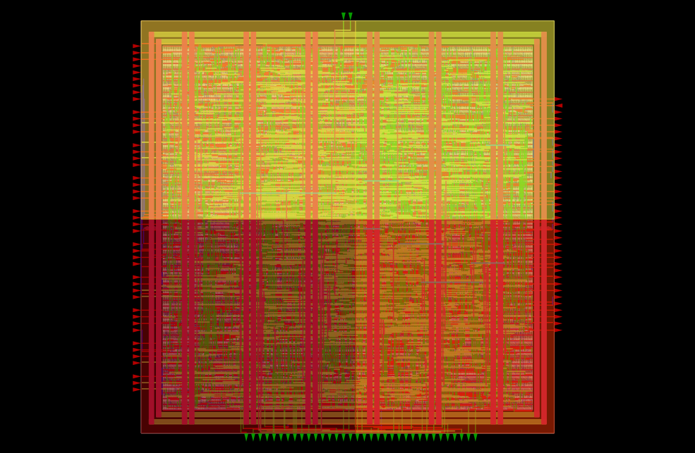

### Sign-off Spatial Heatmaps

The remaining sign-off heatmaps confirm that the finished database is uniform across the board — no congestion pockets after metal fill, no illegal pin access, and a power profile that tracks the placement without hotspots.

| Routing Congestion | Pin Density |
| :---: | :---: |
| 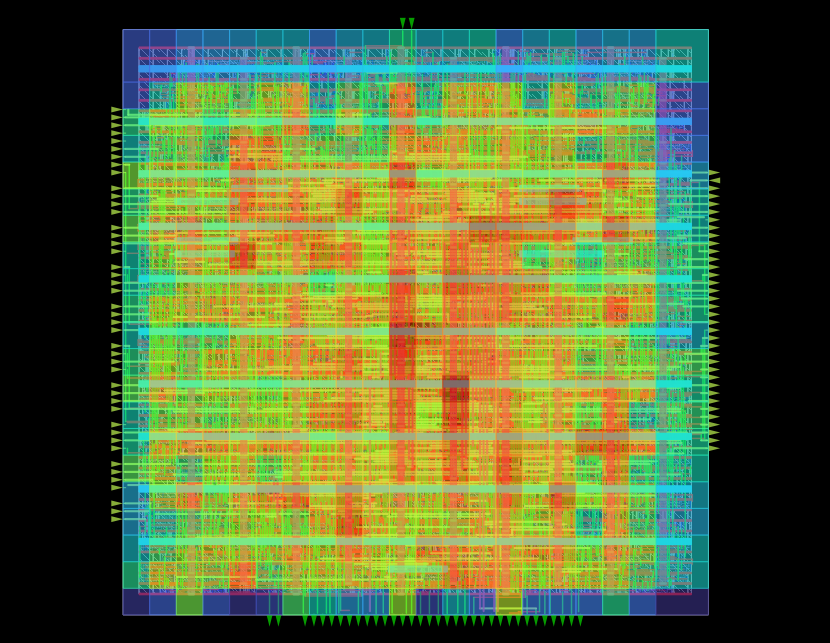 | 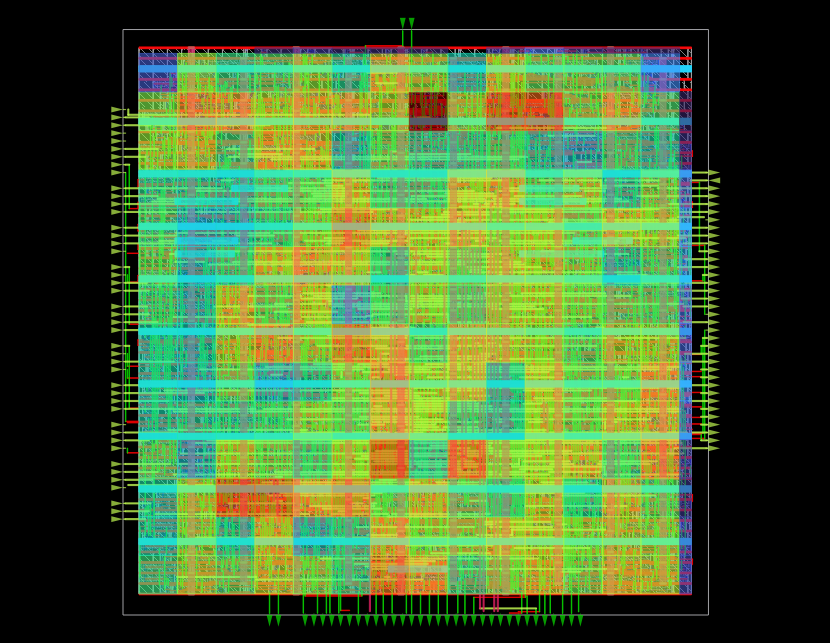 |
| Track-capacity usage after fill — zero overflow tiles remain. | Pin-access density stays legal after detailed routing and filler insertion. |

| Placement Density | Power Density |
| :---: | :---: |
| 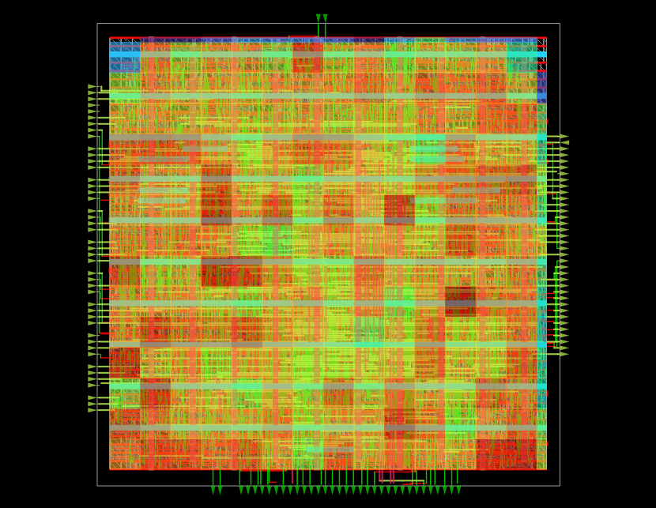 | 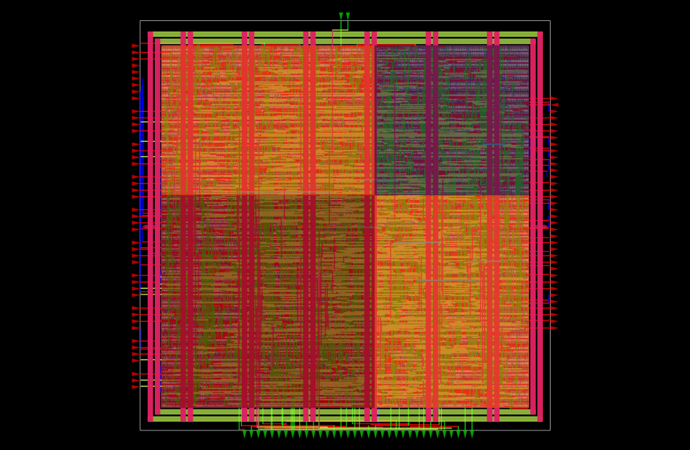 |
| Cell density including the 3390 filler cells, spread evenly across the core. | Static + dynamic power mapped onto the final layout, dominated by the clocked datapath. |

| Estimated Congestion |
| :---: |
| 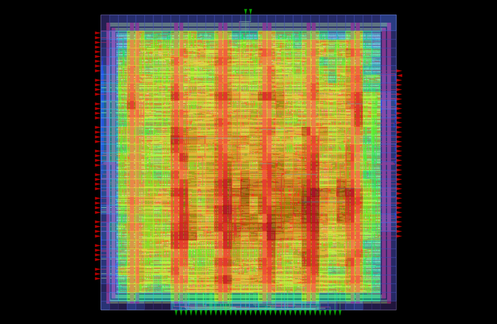 |
| Predicted routing demand versus available track capacity — highlights where wire density approaches the limit and confirms placement kept the design routable before detailed routing. |

---

## GDSII Generation (KLayout)

`gds_generation.tcl` streams the final layout to GDSII. On Sky130 this step used Magic; **on ASAP7 the flow was switched to KLayout**, which handles the ASAP7 LEF/DEF-to-GDS mapping cleanly.

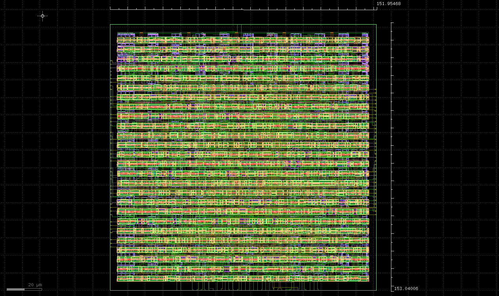

The script generates a KLayout Python stream-out script on the fly, reads the standard-cell GDS (`asap7sc7p5t_28_R_220121a.gds`) so the cell geometries exist in memory, loads the tech and cell LEFs so KLayout understands the DEF vias and macros, reads the sign-off DEF, and writes the merged database:

```
SUCCESS: Final GDS generated successfully at .../GDSII/spi_top.gds
```

---

## Physical Verification / DRC Sign-off

`verification_signoff.tcl` closes the loop. Rather than a separate Magic DRC deck (as on Sky130), the ASAP7 flow **uses the TritonRoute DRC report itself as the sign-off source of truth** — the same engine that routed the design also certifies it. The script parses `detail_route_drc.rpt`, counts violations, and writes a summary:

```
===================================================
       ASAP7 DRC VERIFICATION (TritonRoute)
===================================================
Top Cell                 : spi_top
Total Routing Violations : 0
DRC Status               : PASS
===================================================
```

The DRC report is empty and the final summary reads **0 violations — PASS**. The design is DRC-clean and tapeout-ready on ASAP7.

---

## Results at a Glance

| Metric | Result |
| :--- | :--- |
| Technology | ASAP7 7nm predictive FinFET, 7.5-track RVT |
| Supply | 0.7 V |
| **Max clock** | **2.5 GHz (400 ps period)** |
| Die area | 19.27 µm × 19.27 µm |
| Core area | 293.01 µm² |
| Utilization | 69% |
| Flop count (clock sinks) | 229 |
| Clock buffers | 28 |
| Tap cells / fillers | 32 / 3390 |
| Routed wirelength | 6200 µm |
| Vias | 17,175 |
| DRC violations | **0** |
| Setup / hold | all path groups MET, positive slack |
| Total power | ≈ 1.207 mW |
| Worst IR drop | 0.71 mV (0.10%) |

---

## Toolchain

| Stage | Tool |
| :--- | :--- |
| Synthesis / mapping | Yosys + ABC |
| Floorplan → detailed route | OpenROAD (`OpenROAD 26Q2`) |
| Parasitic extraction | OpenRCX |
| Static timing | OpenSTA |
| IR / EM analysis | OpenROAD PDNSim |
| GDS stream-out | KLayout |
| DRC sign-off | TritonRoute |
| PDK | ASAP7 (`asap7sc7p5t`, 7.5-track RVT) |

---

*Author: Agnibha Sarkar · RTL-to-GDSII of an APB4 SPI Master on ASAP7 7nm FinFET.*
