# RTL-to-GDSII of APB4-Interfaced SPI (Serial Peripheral Interface) Master

This repository details the complete RTL-to-GDSII physical design implementation of a configurable **Serial Peripheral Interface (SPI) Master** fully compliant with **AMBA APB4 protocol**. The design is implemented using the open-source SkyWater 130nm HD standard cell library, synthesized with Yosys, and physical design executed via the OpenROAD toolchain. The design supports single-frame transactions up to 128 bits, multiple slave select lines (32), and efficient APB4 register access.

---

## RTL Architecture & Hardware Specifications

The entire hardware core runs on a single primary system clock (`PCLK`), with no secondary hardware clocks generated. Clock Domain Crossing (CDC) vulnerabilities are mitigated by generating synchronous strobe pulses for shift register operations.

### System Block Diagram
The complete register-transfer level (RTL) architecture including the APB4 controller interface, internal control registers, clock divider, and 128-bit shift registers is illustrated in the complex schematic view below:

### APB4 Peripheral Interface & Top-Level Pins
The top-level module (`spi_top`) implements a native APB4 slave wrapper. Register addressing is byte-addressable via `PADDR[4:2]`, mapping across eight 32-bit registers (TXx, RXx, CTRL, DIV).

| Pin Name | Direction | Width | Protocol | Description |
| :--- | :--- | :--- | :--- | :--- |
| `PCLK` | Input | 1-bit | System | Main Synchronous Bus Clock. All logic runs here. |
| `PRESETn` | Input | 1-bit | System | Active-Low System Reset. |
| `PADDR` | Input | 5-bit | APB4 | Register Address Bus (Bits [4:2] define reg). |
| `PWDATA` | Input | 32-bit | APB4 | Write Data Bus. |
| `PWRITE` | Input | 1-bit | APB4 | High=Write; Low=Read. |
| `PSEL` | Input | 1-bit | APB4 | Peripheral Select. |
| `PENABLE` | Input | 1-bit | APB4 | Strobe for second phase of access. |
| `PSTRB` | Input | 4-bit | APB4 | Byte lanes for partial writes. |
| `PRDATA` | Output | 32-bit | APB4 | Read Data Bus. |
| `PREADY` | Output | 1-bit | APB4 | Ready signal (Tied high, zero wait-state). |
| `PSLVERR` | Output | 1-bit | APB4 | Slave Error signal (Tied low). |
| `ss_pad_o` | Output | 32-bit | SPI | Direct multi-slave select outputs. |
| `sclk_pad_o`| Output | 1-bit | SPI | Generated Serial Clock. |
| `mosi_pad_o`| Output | 1-bit | SPI | Master Out Slave In data line. |
| `miso_pad_i`| Input | 1-bit | SPI | Master In Slave Out data line. |
| `spi_int_o` | Output | 1-bit | Interrupt | High-active transaction complete interrupt. |

### Clock Generation & CDC Mitigation
Reliable operation and complete avoidance of Clock Domain Crossing (CDC) issues are achieved by strictly generating synchronous *strobes* rather than distinct clocks for internal logic. All flip-flops drive exclusively off `PCLK`. The `clk_gen` module monitors an internal counter tracking against the 16-bit `divider` register value to assert single-cycle pulses (`pos_edge` and `neg_edge`).

* **SPI Clock Generation:** The SPI Serial Clock output (`sclk_pad_o`) frequency $f_{\text{SCLK}}$ is derived from the main system clock $f_{\text{PCLK}}$ using the formula:
    $$f_{\text{SCLK}} = \frac{f_{\text{PCLK}}}{2 \times (\text{divider} + 1)}$$
* **Safe Sampling & Launching:** outbound `mosi_pad_o` data bits are launched exclusively on the `neg_edge` strobe. Inbound `miso_pad_i` data bits are sampled exclusively on the `pos_edge` strobe.

### 128-bit Datapath & Shifter
The core provides robust transaction support up to 128 bits per frame. Host CPU access is limited to 32-bit registers (TX_0-TX_3 and RX_0-RX_3). The `shifter.v` module implements complex logic to aggregate or distribute data between the standard APB interface and the wide internal shift registers.

* **Multi-Driver Prevention:** A critical design requirement, verified during RTL coding, is the prevention of multi-driver scenarios where internal signals are driven from multiple `always` blocks. Inside `shifter.v`, all assignment logic for a given counter, shift register, or control bit is constrained within a **single synchronous procedural block**. This ensures that Yosys does not infer conflicting logic or multiple drive for a single net during synthesis.
* **Variable Bit Length support:** The configuration register CHAR_LEN (Bits 11:4 of SPI_CTRL) dynamically sets the exact number of bits per transaction, from 1 up to 128 bits. The datapath uses `PSTRB` byte lanes to enable specific 32-bit latches, allowing efficient partial word writes for smaller transfers.

### Transaction Lifecycle 
The transaction lifecycle is tightly controlled by handshakes between the register file and the shifter logic, using `go`, `t_progress`, and `last_bit` signals.

1.  **Initiation:** The host CPU pre-loads TX registers and sets the `GO` command flag (SPI_CTRL Bit 12).
2.  **Execution:** The control logic asserts `t_progress` and latches CHAR_LEN into the decrement counter (`counter <= len`). The core automatically pre-loads the first bit onto `mosi_pad_o` with zero latency.
3.  **Shifting:** The core decrements the counter at every valid `pos_edge`. The shifter updates MOSI on `neg_edge` and samples MISO on `pos_edge`.
4.  **Completion:** When the counter reaches zero (`last_bit` goes high), the core waits for the final trailing `neg_edge`, then de-asserts `t_progress`. It automatically clears the `GO` bit and fires the external `spi_int_o` high to alert the CPU.

### Control Register Mapping (`SPI_CTRL`)
The 16-bit wide primary configuration register in the top level module (at address offset `0x10`) is mapped as follows:

| Bit Index | Field Flag | Reset | Functional Property |
| :--- | :--- | :--- | :--- |
| `15` | `ASS` | `1'b0` | **Automatic Slave Select:** High = SS lines activate during data transfer only. Low = SS manual software control. |
| `14` | `IE` | `1'b0` | **Interrupt Enable:** Enables firing `spi_int_o` high on frame completion. |
| `13` | `LSB` | `1'b0` | **Bit Order Config:** High = LSB first; Low = MSB first. |
| `12` | `GO` | `1'b0` | **Transaction Init:** Writing `1` initiates the transfer. Automatically cleared on frame complete. |
| `11:4` | `CHAR_LEN` | `8'b0` | **Character Length:** Defines transaction length from 1 to 128 bits. |
| `3:0` | `Reserved` | `4'b0` | Reserved system bits. |

---

## Timing Constraints & Synthesis Methodology

### Synopsys Design Constraints (SDC) Analysis
The performance and synthesis targets are explicitly defined in `constraints.sdc` using industry-standard commands. All external interfaces are constrained to realistic physical boundaries to model a real system environment.

* **Primary Clock Period:** The design targets a fundamental system period constraint of **5.0 ns** (equivalent to **200 MHz**), defined on the input port `PCLK` under the logical identifier `APB_CLK`.
* **Uncertainty and Latency:** The clock definition includes modeling for explicit source latency and network clock latency values of **0.2 ns**, accounting for physical clock distribution effects.
* **Virtual Clock Reference:** An unmapped virtual clock, `vclk_APB_CLK`, is defined with identical period boundaries to model the behavior of the external SPI slave device interface.
* **Peripheral Delay Boundaries:** The input and output delays are set to **20%** of the target clock period window (**1.0 ns**):
    $$\text{Delay}_{\text{I/O}} = 5.0\,\text{ns} \times 0.20 = 1.0\,\text{ns}$$
    This configuration ensures that all peripheral input signals arrive within the 20% hold time window and all peripheral output signals stabilize within the 20% setup time window.

### Synthesis Execution Workflow
Synthesis is executed via the Yosys open-source synthesis suite, as orchestrated by the `synthesis.tcl` script. The flow generates a technology-mapped gate-level netlist in the SkyWater 130nm HD (High Density) PDK platform using the target performance timing corner model: `sky130_fd_sc_hd__tt_025C_1v80.lib`.

The synthesis flow checks the design through several automated steps:

1.  **RTL Reading & Parsing:** Compiles design files with SystemVerilog parser wrapper (`read_verilog -sv`).
2.  **Elaboration:** Translates behavioral verilog into generic RTL netlist (`proc`), flattens nested hierarchies for optimized DFT placement, and decomposes complex logic like state machines (`fsm`).
3.  **Technology Mapping:** Maps the design to the SkyWater 130nm HD logic gates.
4.  **Gate-Level Optimization:** Integrates specialized components: structural latches (`cells_latch_hd.v`), clock-gating cells (`cells_clkgate_hd.v`), and physical constant tie cells (`sky130_fd_sc_hd__conb_1`) via `hilomap`.
5.  **Netlist Export:** Generates the structural netlist (`spi_top_synth.v`) and outputs a final synthesis statistics report.

## Floorplanning & Power Delivery Network (PDN)

The physical design phase initiates with floorplanning, establishing the die dimensions, I/O pin distribution, standard cell rows, and the foundational power architecture. This layout is optimized to balance standard cell placement density, routability, and power integrity while adhering to stringent foundry design rules.

### Core Boundary & Site Row Generation
Before physical cells can be placed, the logical core area is discretized into a legal placement grid. Based on the SkyWater 130nm standard cell LEF definitions, continuous **site rows** are generated across the core area. These rows are constructed from foundational **unit tiles** (sites). Every standard cell in the design is sized as a multiple of this unit tile width, ensuring perfect snapping to the placement grid and alignment of the underlying N-well and P-well structures.

### Floorplan Specifications & Achieved Metrics
The core dimensions and placement grid were initialized using OpenROAD to accommodate the synthesized netlist while reserving adequate routing resources.

| Parameter | Configured Value | Description |
| :--- | :--- | :--- |
| **Aspect Ratio** | `1.0` (Square) | Ensures symmetric signal propagation and equalizes average wirelengths across the X and Y axes. |
| **Target Utilization** | `65%` | A 65% density target provides a 35% whitespace buffer. This acts as a global soft blockage threshold, critical in the 130nm node to absorb cell swelling during Clock Tree Synthesis (CTS) and mitigate congestion during detailed routing. |
| **Core Margins** | `15.0 um` (All sides) | Provides ample boundary clearance between the active core and the die edge for robust I/O pin placement and power ring routing. |
| **Achieved Utilization** | **`63%`** | Actual standard cell density post-floorplanning, successfully meeting the target threshold. |
| **Total Design Area** | **`12712 um^2`** | Final active core area required to map the SPI Master logic. |

### I/O Pin Placement Strategy
Proper pin placement is critical for the seamless integration of this SPI macro into a larger System-on-Chip (SoC). Instead of allowing the tool to arbitrarily scatter pins, explicit constraints were applied:
* **Die Boundary Snapping:** All structural pins (such as the APB4 bus interface and SPI external signals) are strictly constrained to the core perimeter.
* **Layer Constraints:** I/O pins are assigned to specific intermediate routing layers (e.g., `met2` and `met3`) to prevent interference with the global Power Delivery Network and reserve the lowest layers (`li1`, `met1`) strictly for local intra-cell routing. 

### Tap Cell Insertion
To prevent CMOS latch-up conditions, substrate tap cells (`sky130_fd_sc_hd__tapvpwrvgnd_1`) were systematically inserted across the standard cell site rows at a strictly defined pitch of **14.0 um**. This ensures the N-wells are securely tied to `VDD` and the P-substrate is tied to `VSS`, safely satisfying SkyWater 130nm DRC maximum tap-distance limits. 

### Power Delivery Network (PDN) Architecture
A robust PDN grid is synthesized to supply `VDD` and `VSS` to the standard cells while minimizing **IR drop** (voltage droop) and electromigration (EM) risks. The PDN leverages a hierarchical metal stack approach, inherently acting as routing blockages for standard signal nets on these specific tracks:

1. **Layer 1: Standard Cell Rails (`met1`)**
   * **Width:** `0.48 um` | **Pitch:** `5.44 um`
   * **Strategy:** Created using the `-followpins` argument. Standard cell transistors in the Sky130 HD library have their power and ground pins located on Metal 1. These continuous rails perfectly align with the unit tile site rows.
2. **Layer 4: Intermediate Power Straps (`met4`)**
   * **Width:** `1.60 um` | **Pitch:** `27.20 um`
   * **Strategy:** Thick, low-resistance vertical and horizontal straps distribute power across the core. By pushing the intermediate grid up to `met4`, lower metal layers (`met2`, `met3`) are preserved entirely for dense, localized signal routing, drastically reducing routing congestion.
3. **Layer 5: Top-Level Power Grid (`met5`)**
   * **Width:** `1.60 um` | **Pitch:** `27.20 um`
   * **Strategy:** The primary external power interface layer. Higher metal layers in the Sky130 stack have significantly lower sheet resistance. Creating a dense mesh at `met5` provides a low-impedance path from the external supply down to the core, minimizing global IR drop.

### Via Stack Configuration
To connect this hierarchical grid seamlessly, custom via stacks are instantiated to drop power from the top-level `met5` mesh down to the `met1` standard cell rails:
* `via_4_5`: Drops power from `met5` to `met4`.
* `via_1_4`: A full-stack via array bridging the intermediate straps directly to the local cell rails (comprising stacked vias from M1→M2, M2→M3, and M3→M4).

## Standard Cell Placement & I/O Pin Assignment

Following floorplanning and PDN synthesis, the standard cells synthesized by Yosys are physically placed onto the site rows of the core area. The placement phase is executed in a highly constrained, multi-stage process balancing two fundamentally conflicting physical design goals: **Timing Optimization** (which pulls communicating cells closer together to minimize interconnect delay) and **Routability/Congestion Optimization** (which spreads cells apart to prevent routing chokepoints and lower localized density).

### I/O Pin Placement Strategy
Before internal standard cells can be placed, the top-level I/O pins must be anchored to the core boundaries. As logged during the physical design initialization, pins are strategically grouped by functional bus to minimize wire crossings:
* **Control & Clock Groups:** `[ PCLK PRESETn ]`
* **SPI Interface Bundles:** Multi-bit buses are grouped sequentially (e.g., `[ ss_pad_o[31] ... ss_pad_o[28] ]`) to ensure ordered routing tracks.
* **Layer Constraints:** Pins are explicitly constrained to intermediate routing layers **Metal 2 (met2)** and **Metal 3 (met3)**. This approach keeps dense boundary connections off the base metal layer (`met1`), allowing logic cells to be placed closer to the die edge without inducing Design Rule Check (DRC) violations, while reserving the thicker upper metals strictly for the PDN and global routing.

### Global & Detailed Placement Workflow
The core placement engine relies on OpenROAD to iteratively solve the physical layout:

1. **Global Placement:** The engine performs a coarse, analytical placement using `-timing_driven` and `-routability_driven` algorithms. It evaluates initial RC parasitic estimates to keep critical APB-to-SPI timing paths short, while simultaneously spreading high-pin-count logic to respect a localized density target of **60%**.
2. **Design Repair & HFNS:** A critical optimization pass (`repair_design`) resolves early electrical violations. High Fanout Nets (HFNS) are buffered, and gates are resized to fix maximum slew (transition time) and maximum capacitance limits introduced by the estimated wire lengths.
3. **Detailed Placement (Legalization):** The floating instances from global placement are "snapped" to the nearest legal site rows. The engine utilizes a **diamond search algorithm** constrained to a maximum displacement of **+/- 500 sites horizontally and +/- 100 rows vertically** to resolve any overlapping instances without destroying the optimized global topology.

### Placement Quality & Achieved Metrics
The detailed placement successfully legalized all standard cells with absolute precision. The log analysis confirms a **100.00% Diamond Move Success** rate (1,266/1,266 cells) requiring zero rip-up and replace fallbacks. Furthermore, the maximum, average, and total structural displacement measured exactly **0.0 um**, resulting in a **0% Delta HPWL** between global and detailed placement phases.

| Placement Metric | Achieved Value | Description |
| :--- | :--- | :--- |
| **Total Standard Cells** | `1266` | The complete structural netlist count (logic gates, flip-flops, and tap cells). |
| **Instances Area** | `12568.30 um^2` | Total silicon footprint strictly consumed by placed standard cells. |
| **Core Area** | `20234.41 um^2` | The total available placement grid area within the core boundaries. |
| **Effective Utilization** | `62.1%` | Active logic density. Leaving roughly 38% whitespace is crucial to absorb clock tree buffers during CTS and to allow routing detours in detailed routing. |
| **Total HPWL** | `32905.3 um` | Half-Perimeter Wirelength. A foundational metric indicating total estimated routing length. The tool successfully minimized this without causing congestion. |
| **Placement Legality** | `100% Success` | Zero physical Design Rule Violations (overlaps) or placement failures reported post-legalization. |
| **Timing (WNS / TNS)** | `0.00 ns` / `0.00 ns` | Worst Negative Slack and Total Negative Slack are clean based on placement-stage RC estimations, indicating no immediate setup/hold violations. |

### Congestion & Density Analysis
To ensure the SPI protocol logic is highly routable and free of localized anomalies, spatial density evaluations were executed. Congestion-driven placement proactively inflates the footprint of cells in heavily connected regions (acting as partial soft blockages) to force logic spreading. 

| Routing Congestion | Pin Density | Power Density |
| :---: | :---: | :---: |
|  |  |  |
| **Estimated Routing Congestion (RUDY):** Highlights regions where routing track demand approaches supply. The `-routability_driven` flag successfully dispersed logic, guaranteeing zero unroutable chokepoints for the global router. | **Standard Cell Pin Density:** Maps the spatial concentration of I/O terminals. An even distribution ensures the detailed router will not fail when attempting to drop vias into localized standard cell pins. | **Estimated Power Density:** Projects dynamic and static power dissipation based on active logic placement. An even power profile prevents localized IR-drop (voltage sag) and thermal hotspots. |

## Clock Tree Synthesis (CTS)

Following standard cell placement, Clock Tree Synthesis (CTS) is performed to distribute the system clock signal (`PCLK`) evenly across all sequential components in the design. The primary objective of this physical design phase is to minimize clock skew (arrival time differences between flip-flops) and insertion delay, while maintaining balanced transition times (slew) across the entire clock distribution network.

### Clock Tree Synthesis Specifications & Configuration
The clock tree is synthesized by constructing an H-Tree topology using OpenROAD's TritonCTS engine. This balanced geometric topology ensures that the path lengths from the clock root to all sequential sinks are as uniform as possible, structurally limiting skew before electrical tuning. 

To optimize power and wirelength, **Sink Clustering** was explicitly enabled. This technique groups spatially proximate flip-flops (up to 20 sinks within a 50 um diameter) to be driven by a common localized buffer, significantly reducing the overall clock routing capacitance.

| Parameter | Achieved Value | Description |
| :--- | :--- | :--- |
| **Clock Net / Domain** | `PCLK` / `APB_CLK` | The global system clock net targeted for synthesis. |
| **Total Clock Sinks** | `229` | The total number of flip-flop clock pins driven by the synthesized network. |
| **Network Topology** | `H-Tree` | Geometric balancing strategy used to equalize latency across branches. |
| **Selected Clock Buffer** | `sky130_fd_sc_hd__clkbuf_4` | A balanced-drive strength clock buffer used exclusively for root, sink, and intermediate branching to maintain uniform delay characteristics. |
| **Sink Clustering Strategy** | `Size: 20` / `Diameter: 50 um` | Spatial boundary constraint for grouping sinks to minimize local wire lengths, lowering both clock power and dynamic skew. |
| **Post-CTS Design Area** | `13084 um^2` | Total active area strictly consumed by logic cells plus the newly inserted clock buffers. |
| **Post-CTS Utilization** | `65.0%` | Final cell density resulting from network insertion, reflecting a nominal ~3% area bump from the pre-CTS placement density (62.1%). |
| **Timing Slack (WNS)** | `+0.56 ns` (MET) | Timing validation confirms all setup requirements are satisfied with a positive margin based on a 4.20 ns required / 3.64 ns arrival timeline. |

### Network Optimization and Legalization Workflow
The integration of the clock tree is not a single-step process; it follows a rigorous automated optimization loop defined in the configuration script to guarantee physical and electrical correctness:

1. **Clock Inverter Optimization (`repair_clock_inverters`):** Redundant or back-to-back inverter chains present in the synthesized netlist are detected and removed to decrease unnecessary baseline latency and dynamic switching overhead.
2. **CTS & Parasitic Extraction:** Following H-Tree synthesis and clustering, interconnect RC parasitics are estimated (`estimate_parasitics -placement`) to provide real-time latency and skew projections based on the updated cell layout.
3. **Physical Legalization:** Newly inserted clock network buffers are floating. They are snapped onto standard cell site rows using detailed placement (`detailed_placement`), resolving physical overlaps while minimizing the displacement of nearby logic blocks.
4. **Timing Repair (`repair_timing`):** The design undergoes automated timing repair to resolve any setup, hold, or slew violations introduced by the realistic clock network delays. The engine strictly matches structural footprints (`-match_cell_footprint`) during buffer resizing to prevent cascading layout disruptions.

### Post-CTS Spatial & Congestion Analysis
To validate that the addition of the clock distribution network did not introduce localized routing blockages, cell crowding, or dynamic power issues, structural heatmaps are evaluated across the synchronized core grid:

| Routing Congestion | Pin Density | Power Density |
| :---: | :---: | :---: |
| 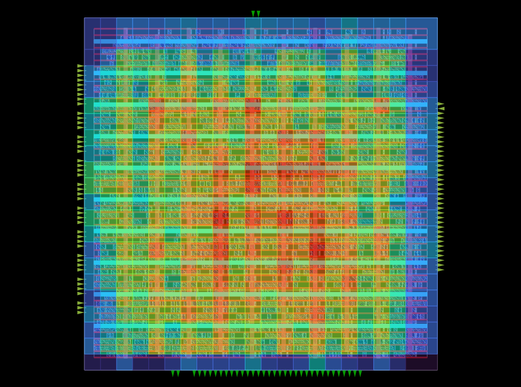 | 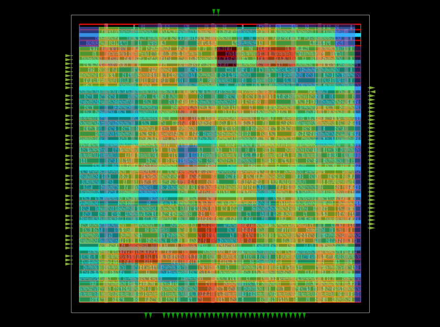 | 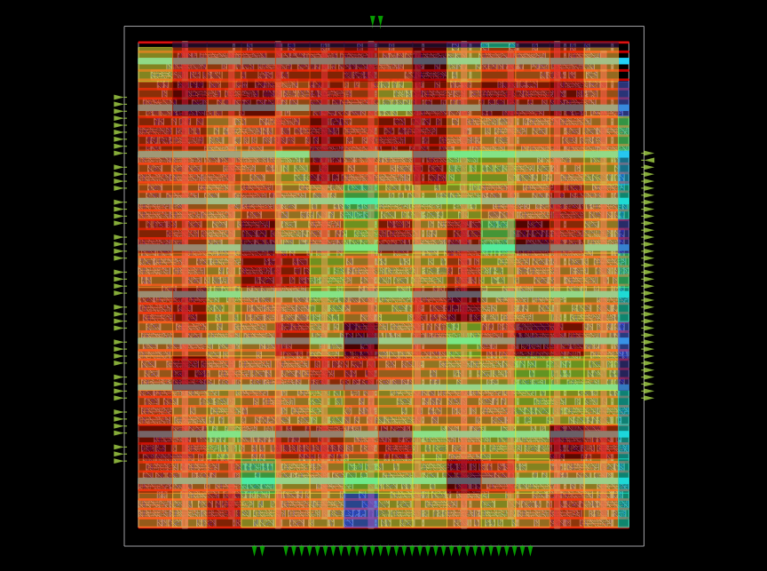 |
| **Post-CTS Routing Congestion (RUDY):** Tracks localized routing track usage. The symmetric buffer distribution and clustering successfully avoid routing bottlenecks, preserving standard cell routing channels for the global router. | **Post-CTS Pin Density:** Maps the physical concentration of cell pins. The detailed placement engine successfully absorbed the new clock buffers without exceeding localized pin availability thresholds. | **Post-CTS Power Density:** Illustrates the active power profile. Grouping sinks and distributing clock buffers symmetrically prevents concentrated current spikes along the primary VDD/VSS supply grid. |

## Global Routing & Design Optimization

Following Clock Tree Synthesis, the physical design advances to Global Routing. The routing engine abstracts the core area into a grid of G-cells and algorithmically assigns coarse routing paths for all 1,347 electrical nets. This phase resolves large-scale interconnect topologies, mitigates routing congestion, and performs aggressive timing and power optimizations before detailed track assignment. The primary goal of this stage is to achieve design convergence with the best possible Quality of Results (QoR). By making an intelligent tradeoff between accuracy and runtime, the routing engine solves a large number of design violations quickly while reserving high-accuracy solver techniques for the most stubborn routing problems.

### Layer Allocation & Design Specifications
To balance routing resources and satisfy rigorous performance constraints, hierarchical routing layer restrictions are enforced. Signal nets are distributed across lower and intermediate metals, while the critical clock network is elevated to thicker upper metals to minimize interconnect resistance and parasitic capacitance.

| Parameter | Configuration / Metric |
| :--- | :--- |
| **Signal Routing Layers** | `met1` through `met5` |
| **Clock Routing Layers** | `met3` through `met5` |
| **Total Physical Components** | `1591` |
| **Total Routed Nets** | `1347` |
| **Top-Level I/O Terminals** | `118` |
| **Die Boundary Dimensions** | `151.61 um x 151.61 um` |
| **Congestion Iterations** | `50` |
| **Standardized Transitions** | `M1M2_PR`, `M2M3_PR`, `M3M4_PR`, `M4M5_PR` |

### Integrated Optimization Workflow
Global routing is executed iteratively alongside static timing analysis (STA) and electrical rule checks to guarantee a structurally and electrically robust database. Leveraging a scalable, solver-based approach, the engine concurrently optimizes multiple QoR metrics—including setup, hold, maximum transition, cell area, and power—through the following sequence:

1. **Interconnect Parasitic Extraction:** Real-time RC parasitics are estimated across the global routing paths to drive timing-aware delay calculations and optimization algorithms.
2. **Design Rule Violation (DRV) Repair:** The engine identifies and repairs maximum capacitance (`max_cap`) and maximum transition time (`max_tran`) violations on heavily loaded nets via automated buffer insertion and gate resizing.
3. **Footprint-Matched Timing Repair:** Setup and hold timing violations exposed by the newly added wire delays are resolved simultaneously. The tool swaps standard cells for alternative drive-strength variants that share the exact physical footprint, maintaining placement legality.
4. **Power Recovery Optimization:** To optimize the Power-Performance-Area (PPA) envelope, the engine identifies timing paths with comfortable positive slack. High-drive, power-intensive cells on these paths are systematically downsized to lower-leakage variants without introducing new timing violations.

### Antenna Effect Mitigation
During the plasma etching stages of semiconductor fabrication, long exposed metal traces act as antennas, accumulating electrostatic charge. If a trace is connected exclusively to a highly sensitive MOSFET gate oxide, the accumulated potential can cause dielectric breakdown, destroying the transistor. 

This layout strictly adheres to the SkyWater 130nm Foundry antenna rules. An automated antenna repair pass is executed to systematically reduce the **Antenna Ratio** (Area of Exposed Metal / Area of Connected Gate Oxide). The mitigation strategy utilizes **layer hopping** (jumper insertion), where excessively long routing tracks are broken and bridged through higher metal layers using vertical vias. Post-repair validation confirms **zero antenna violations** across the design, ensuring long-term silicon reliability.

### Routing Guides Generation
Upon completion of the global routing and optimization passes, the localized coarse paths are exported as routing guides (`spi_top.route_guide`). These geometric boundaries constrain the subsequent TritonRoute detailed routing engine, ensuring that final metal track assignments conform to the optimized global topology.

### Spatial Analysis & Congestion Profiling
Multi-variant structural heatmaps are generated post-routing to verify track utilization, standard cell density, and the active power profile across the core grid.

| Estimated Congestion | Routing Track Congestion |
| :---: | :---: |
| 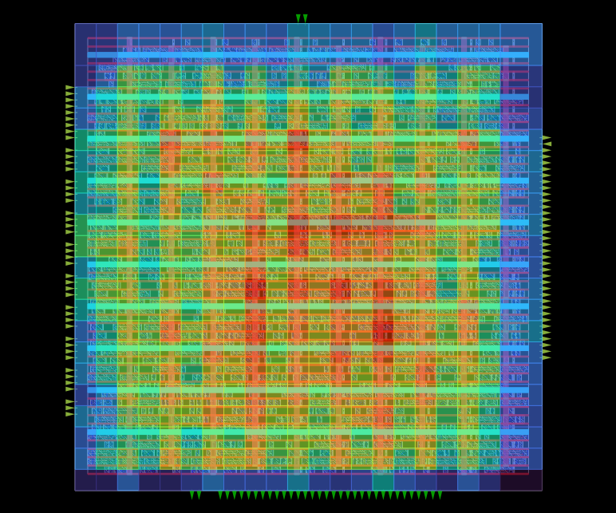 | 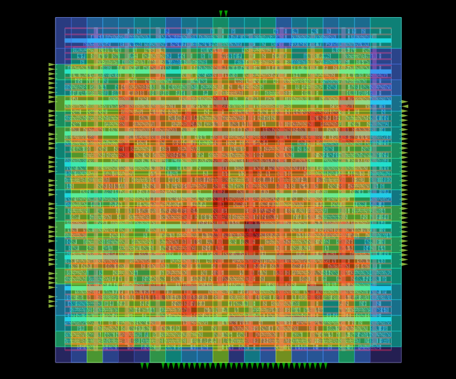 |
| **Estimated Grid Congestion:** Highlights G-cells approaching maximum routing capacity. | **Routing Track Congestion:** Verifies physical interconnect distribution across active metal layers. |

| Pin Density | Placement Density | Power Density |
| :---: | :---: | :---: |
| 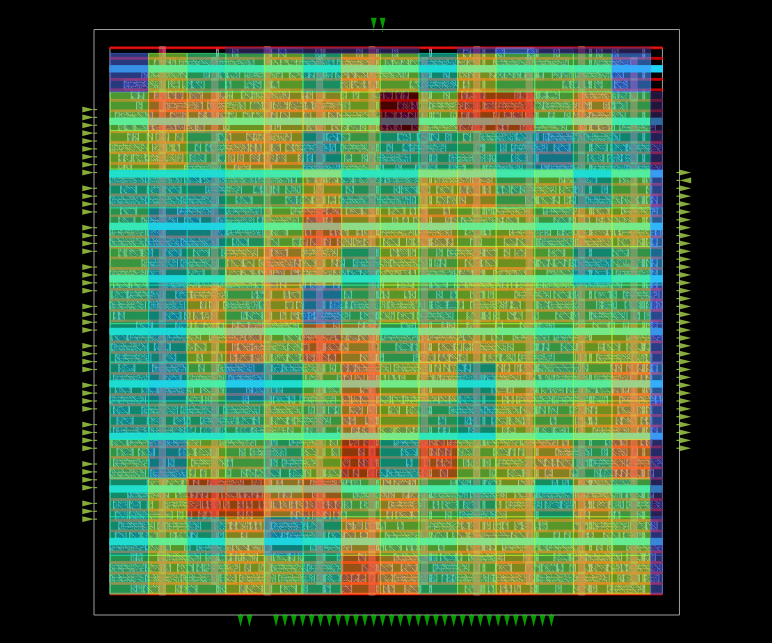 | 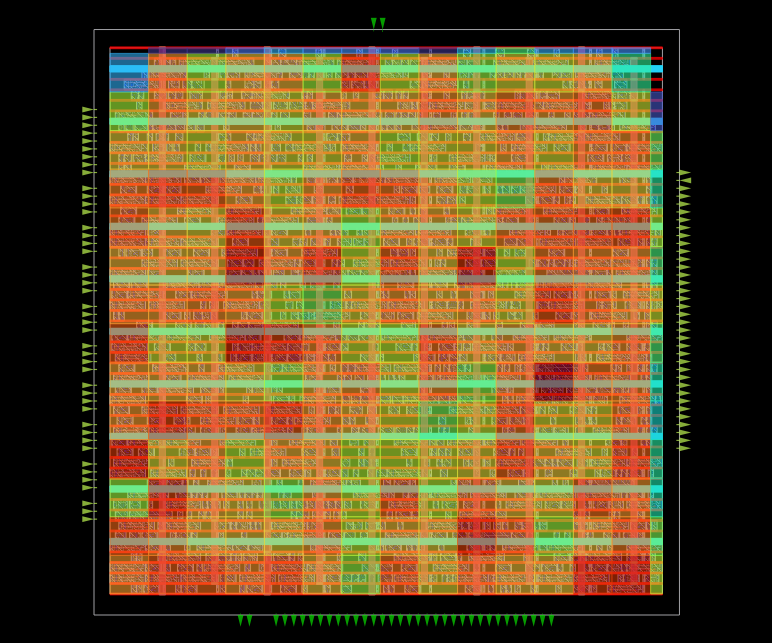 | 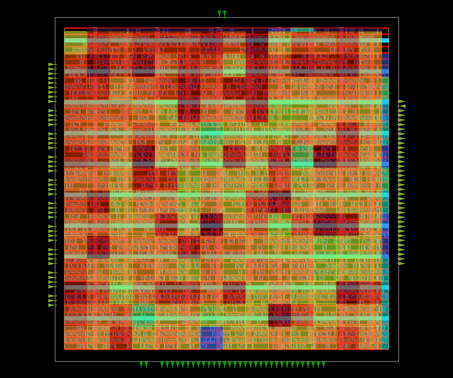 |
| **Global Pin Concentration:** Maps logical terminal density to prevent localized routing blockages. | **Standard Cell Density:** Confirms placement legality and density constraints following footprint-matched resizing. | **Active Power Profile:** Monitors spatial power dissipation to preempt thermal or localized IR-drop anomalies. |

## Detailed Routing

The final major physical implementation stage is **Detailed Routing**, where the coarse, G-cell-based topological paths generated during global routing are translated into exact, Design Rule Check (DRC)-compliant physical metal tracks and vias. While global routing prioritizes speed and macro-level congestion mitigation, detailed routing prioritizes sub-micron precision and silicon manufacturability. 

Using the OpenROAD TritonRoute engine, this stage executes highly complex, solver-based pathfinding algorithms. The tool systematically connects all standard cell pins, macro terminals, and external I/O ports while strictly obeying complex manufacturing rules, including minimum spacing, minimum area, via enclosures, and end-of-line (EOL) spacing constraints defined in the SkyWater 130nm technology LEF.

### Routing Layer Constraints & Tool Configurations
To optimize the overall Power-Performance-Area (PPA) envelope and ensure robust signal integrity, strict layer assignment constraints were passed to the routing engine. By confining the fast-switching clock signals to the upper, thicker metal layers, the design minimizes insertion delay and dynamic power consumption.

| Parameter | Configuration / Constraint |
| :--- | :--- |
| **Routing Engine** | `TritonRoute` |
| **Signal Routing Layers** | Restricted to `met1` through `met5` |
| **Clock Routing Layers** | Restricted to `met3` through `met5` |
| **Max Routing Iterations** | Requested: `100` $\rightarrow$ Tool Capped: `64` |
| **Patch Cleanup** | Enabled (`-clean_patches`) to eliminate redundant metal fragments |
| **DRC Convergence Target** | `0` Violations |

### Guide Coverage & Heuristic Adherence
Detailed routing is heavily constrained by the `route_guide` boundaries generated during global routing. The engine attempts to keep all localized wire segments strictly within these geometric regions to preserve the congestion optimizations resolved in the previous stage. 

The generated `guide_coverage.rpt` validates this heuristic adherence. For the vast majority of critical nets (e.g., control logic and shift register datapaths like `u_shift.IN_reg` and `ctrl`), the detailed router successfully achieved **100% guide coverage** on lower layers (`li1`, `met1`, `met2`). The engine only dynamically maneuvered outside these boundaries when absolutely necessary to resolve localized pin access issues and avoid hard DRC violations.

### Post-Route Antenna Repair Optimization
A critical closed-loop optimization step is executed post-routing to guarantee manufacturing reliability and yield. 

1. **Antenna Ratio Verification:** The engine scans the fully routed database for long, continuous metal lines that could act as antennas during plasma etching.
2. **Iterative Repair Loop:** If residual antenna violations are flagged despite the global router's earlier jumper insertions, a secondary `repair_antennas` pass is triggered.
3. **Incremental Re-Routing:** Because detailed routing patches or inserted vias can alter the pre-calculated antenna ratios, the script automatically triggers an incremental detailed route loop to seal any newly created violations, ensuring the final layout is structurally impervious to gate-oxide breakdown.

### Physical Design Achievements & QoR (Quality of Results)
The detailed routing log indicates a highly successful design convergence. The routing engine systematically reduced the violation count from thousands down to zero, culminating in a pristine, DRC-clean database ready for parasitic extraction and signoff.

| Metric | Achieved Value | Industry Context |
| :--- | :--- | :--- |
| **Total Wire Length** | `42,996 um` | The total physical length of all routed metal tracks across all layers (`met1` to `met5`). |
| **Total Inserted Vias** | `10,019` | The total count of inter-layer vias required to traverse the routing grid. |
| **Initial DRC Violations** | `1,338` | Violations present during the first routing iteration before spatial conflict resolution. |
| **Final DRC Violations** | **`0`** | The design achieved 100% DRC compliance, passing all complex LEF rules. |
| **Timing Setup Slack (WNS)** | `+1.29 ns` | Positive setup slack confirms no max-delay violations exist under real, routed wire parasitics. The design safely meets the 200 MHz system clock constraint. |
| **Timing Hold Slack (TNS)** | `0.00 ns` | Zero total negative slack validates that all structural buffering and track detours preserved hold-time integrity. |

### Spatial Analysis & Post-Route Congestion Profiling
The final physical layout is subjected to structural analysis to ensure no thermal hotspots or density anomalies exist before signoff extraction.

| Estimated vs. Actual Congestion | Routing Track Congestion |
| :---: | :---: |
| 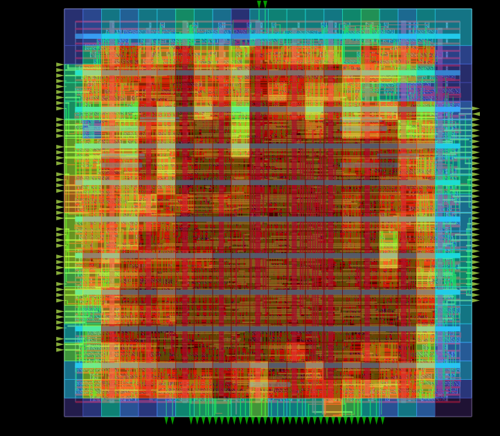 | 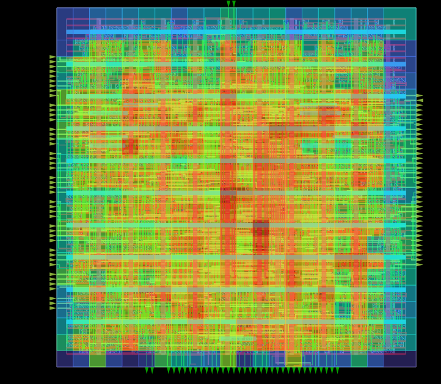 |
| **Estimated Grid Congestion:** Theoretical routing bottlenecks mapped just prior to physical metal assignment. | **Actual Routing Congestion:** Verifies uniform distribution of localized physical interconnects across the active core. |

| Pin Density | Placement Density | Power Density |
| :---: | :---: | :---: |
| 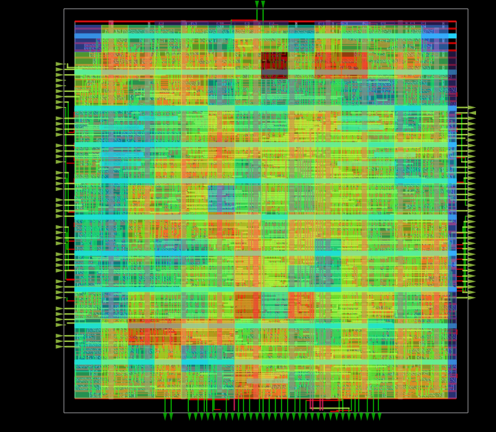 | 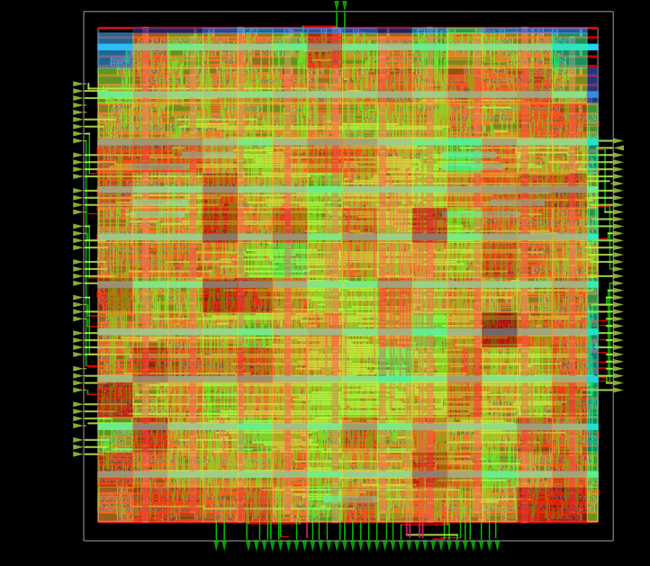 | 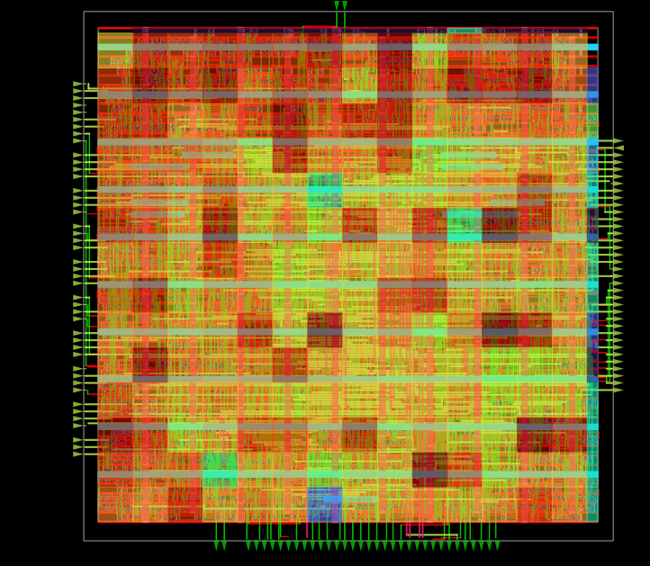 |
| **Global Pin Concentration:** Validates that detailed routing patches successfully accessed heavily packed standard cell terminal regions. | **Final Cell Density:** Confirms placement legality is maintained post-routing optimizations. | **Active Power Profile:** Maps final spatial power estimation considering actual routed parasitic wire capacitances. |

## Physical Signoff & Power Integrity Analysis

The final stage of the RTL-to-GDSII flow encompasses physical signoff, extraction, and power integrity validation. This phase transitions the structurally routed database into a strictly DRC-compliant layout ready for tapeout. Critical manufacturing yield checks, highly accurate 3D parasitic extractions, and static voltage drop simulations are executed to guarantee silicon success.

### 1. Yield Optimization: Filler & Metal Insertion
Before layout geometries can be extracted, the core must be fully populated to comply with foundry density rules and semiconductor manufacturing physics.

* **Standard Cell Filler Insertion:** To prevent base-layer design rule violations (DRCs) and guarantee the electrical continuity of the N-well, P-substrate, and local `met1` power rails, non-functional standard cell fillers were inserted into all empty site row gaps. A total of **1,722 filler instances** (`sky130_fd_sc_hd__fill_X`) were snapped to the grid. A post-insertion legalization check verified **7,168 structural connections** with absolute zero placement conflicts.
* **Metal Fill Generation (CMP Consistency):** To prevent metal dishing and ensure planar uniformity during Chemical-Mechanical Planarization (CMP), dummy metal fills were algorithmically generated using the platform's `fill.json` rules. Fills were populated exclusively on the active routing layer (`met1`), while base layers (`nwell`, `pwell`, `li1`, `mcon`) were explicitly bypassed per SkyWater 130nm process rules.

### 2. Signoff Parasitic Extraction (RCX)
To perform final timing signoff, the theoretical RC approximations used during routing are discarded. The OpenRCX extraction engine calculates exact interconnect resistance and coupling capacitance based on the physical geometries of the routed metal shapes and vias. 

Governed by the `rcx_patterns.rules` technology file, the engine extracted the 3D parasitic network and generated the **Standard Parasitic Exchange Format (SPEF)** file (`spi_parasitics.spef`). This SPEF netlist is subsequently back-annotated into the OpenSTA engine for high-fidelity timing and power analysis.

### 3. Signoff Timing & Power Profiling
Evaluated against the back-annotated SPEF parasitics, the SPI Master macro demonstrated robust timing convergence. The design comfortably clears the 200 MHz system clock constraint with zero violations.

| Timing Metric | Achieved Slack | Status |
| :--- | :--- | :--- |
| **Worst Negative Slack (WNS)** | `+1.9268 ns` | **MET** (No setup violations under max delay) |
| **Total Negative Slack (TNS)** | `0.0000 ns` | **MET** |

**Total Power Dissipation:** Based on the final switching activity and extracted wire capacitance, the total design power is estimated at **5.079 mW**. 

| Logic Group | Internal Power | Switching Power | Leakage Power | Total Power | % of Total |
| :--- | :--- | :--- | :--- | :--- | :--- |
| **Sequential (Flip-Flops)** | 2.163 mW | 0.458 mW | 3.06 nW | 2.621 mW | 51.6% |
| **Combinational Logic** | 0.449 mW | 0.644 mW | 2.28 nW | 1.093 mW | 21.5% |
| **Clock Tree Network** | 0.604 mW | 0.761 mW | 0.27 nW | 1.365 mW | 26.9% |
| **Total (System)** | **3.216 mW** | **1.864 mW** | **5.61 nW** | **5.079 mW** | **100.0%** |
*Note: The high proportion of sequential and clock power is characteristic of a heavily synchronized, 128-bit shift-register-based SPI architecture.*

### 4. Power Integrity: IR Drop & Electromigration (EM)
A static voltage drop analysis was executed to validate the integrity of the Power Delivery Network (PDN). The OpenROAD `analyze_power_grid` engine evaluated the continuous VDD and VSS meshes against the localized current demands of the standard cells.

* **Grid Connectivity:** `check_power_grid` confirmed 100% continuous electrical tracking from the external strap sources (`vsrc.loc`) down to every individual logic gate.
* **Static IR Drop:** Operating at a nominal 1.80V supply, the extreme worst-case terminal voltage across the entire core dropped to just **1.79986 V**. This microscopic localized voltage sag of **~0.14 mV** unequivocally validates the massive over-provisioning of the top-level `met5` and intermediate `met4` power meshes.

### 5. Final Core Area & Spatial Verification
The physical signoff completes with the finalized spatial and density metrics, confirming the macro is within the prescribed boundary limits.

* **Total Core Die Area:** `20,234.41 um^2`
* **Active Logic Instance Area:** `12,568.30 um^2`
* **Final Effective Utilization:** `62.1%` (excluding non-functional filler cells)

#### Signoff Spatial Heatmaps
The final structural heatmaps confirm uniform distribution across the completed database, ensuring no thermal anomalies or post-fill congestion issues.

| Routing Congestion | Pin Density |
| :---: | :---: |
|  |  |
| **Final Routing Congestion:** Confirms zero track capacity violations post-metal fill. | **Final Pin Density:** Validates pin access remains strictly legal after detailing. |

| Placement Density | Power Density |
| :---: | :---: |
|  |  |
| **Global Placement Density:** Incorporates active logic and the 1,722 filler standard cells. | **Signoff Power Profile:** Maps final static and dynamic power across the exact physical layout. |
